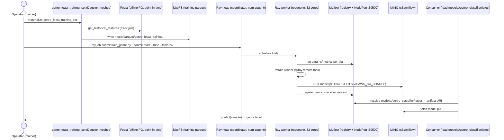

# Flow — ML lifecycle end-to-end (silver → Feast → Ray train → MLflow register → serve/consume)

The full model lifecycle for the **`genre_classifier`**, threading four component flows plus the leg none of them
close — **consuming the registered model**. Feast serves the Spotify audio features point-in-time and the
in-cluster meshed bridge asset `genre_feast_training_set` does the leakage-free `get_historical_features` join to
lakeFS parquet ([flow-feast.md](flow-feast.md)); a Ray Tune HP sweep runs on the rogueone edge worker
([../demos/remote-training.md](../demos/remote-training.md)); the winner is registered as a new
`genre_classifier` version in MLflow, artifact PUT direct to MinIO ([flow-mlflow.md](flow-mlflow.md)); and the
missing leg loads `models:/genre_classifier/latest` back from the registry and scores a sample, proving the
registered artifact is a usable model, not just a catalog row. See [../demos/ml-lifecycle-e2e.md](../demos/ml-lifecycle-e2e.md).

**Current reality:** heavy training runs on **rogueone** (`192.168.1.230`, RTX 5000 Ada, 32 cores); weyland
(mother) is the control plane (MLflow tracking + registry, MinIO artifacts, lakeFS silver). The Ray head is a
coordinator (`--num-cpus=0`); trials schedule onto the rogueone worker. External clients reach MLflow via the LAN
NodePort `192.168.1.243:30500` (iptables-pinned to rogueone); MinIO TLS is verified via `AWS_CA_BUNDLE`.

## Sequence

Same features → ~same accuracy as `--source silver` (v7 f1 ≈ 0.314); Feast buys point-in-time correctness +
train/serve consistency, not a better model. The consume leg closes the lifecycle from raw silver to a live
prediction — a column mismatch against `train_genre.py`'s feature list is the only thing that fails it. There is
no standing MLflow serving deployment for `genre_classifier`; the REST-endpoint form is the same model behind an
HTTP surface, treated as the follow-up.
