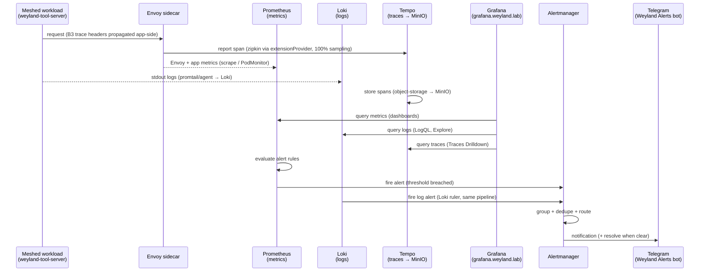

# Flow (E2E) — Observability: app emits → Prometheus / Loki / Tempo → Grafana → Alertmanager → Telegram

Cross-system thread of [flow-tracing](flow-tracing.md) and [flow-alerting](flow-alerting.md) into one picture: a
meshed workload emits all three signals (metrics, logs, traces), each lands in its store, Grafana is the single
read pane over all three, and a breached rule pages the operator on Telegram. **Tempo, not Jaeger** (Jaeger
retired B48). Demo: [../demos/observability-e2e.md](../demos/observability-e2e.md).

**Seams made explicit:** tracing owns span → Tempo → Grafana/Kiali ([tracing](../demos/tracing.md)); alerting owns
rule → Alertmanager → Telegram ([alerting](../demos/alerting.md)). Grafana is the join point across all three
signals; metric alerts (Prometheus) and log alerts (Loki ruler) ride the **same** Alertmanager → Telegram path.
