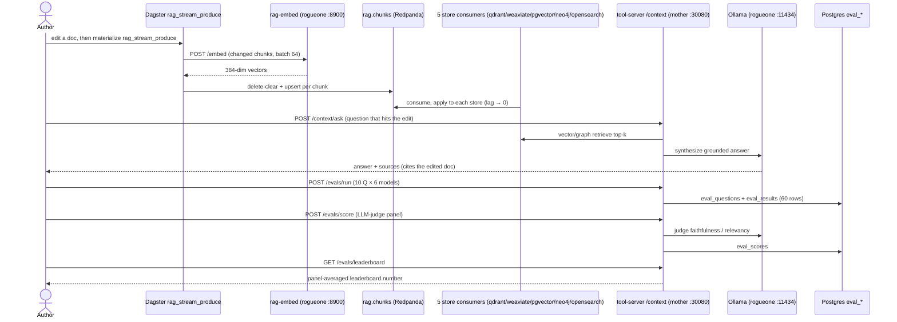

# Flow — RAG end-to-end (doc change → index → retrieve → eval)

The single arc that starts from an **actual doc edit** and ends on a **leaderboard number**, threading four
already-validated component flows into one story: a changed doc is chunked, embedded **once** on the rogueone GPU
(`rag-embed`, `192.168.1.230:8900`), and streamed through Redpanda `rag.chunks` into all five stores
([flow-rag-stream.md](flow-rag-stream.md)); the tool-server retrieves the new chunk and synthesizes a grounded
answer via Ollama ([flow-rag-query.md](flow-rag-query.md)); an eval run asks a corpus-grounded question set across
all 6 local models ([flow-eval.md](flow-eval.md)); and an LLM-judge panel scores the run so the leaderboard
tightens ([flow-eval-scoring.md](flow-eval-scoring.md)). Nothing here is new mechanism — it is the seam between
the four flows made explicit. See [../demos/rag-e2e.md](../demos/rag-e2e.md).

**Current reality:** Ollama (generator + judges) runs on **rogueone** (`192.168.1.230`, RTX 5000 Ada), moved off
the retired CT-102 in B79. The embedding service `rag-embed` is a separate native systemd unit on the same box
(`:8900`). `kubectl` runs on mother; the tool-server is a NodePort at `mother:30080`.

## Sequence

The three-judge panel tightens the field to roughly **0.75–0.82** faithfulness, with `gpt-oss:20b` the most
defensible RAG pick (top-2 under every judge, and not itself a judge → zero self-bias). Per-leg detail lives in
the four component flows and their demos.
