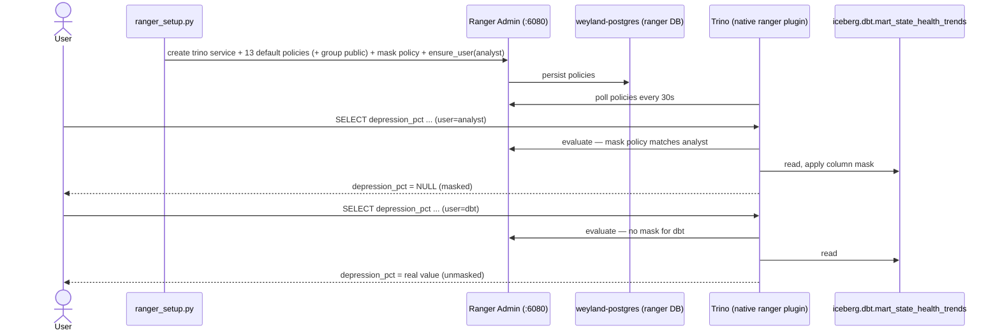

# Flow — Ranger column masking (masked vs unmasked Trino query, E2E)

A single before/after that proves an Apache Ranger **column-masking** policy: the **same** query on the **same**
mart (`iceberg.dbt.mart_state_health_trends`) returns real values for one Trino user and `NULL` for another,
because Trino 468's **native** Ranger access-control plugin (`access-control.name=ranger`) masks `depression_pct`
for the `analyst` user. Ranger is Slice A of the L5 (Governance/Security) layer, governing table/column/row
policies, masking, and row filters for `iceberg.dbt.*` and everything else Trino federates. `ranger_setup.py`
creates the `trino` service, the 13 default policies (each extended with group `public` so the default-deny
plugin does not lock every consumer out), the mask policy, and the `analyst` ROLE_USER via `ensure_user()` (a
policy referencing a non-existent user 400s). The plugin polls Ranger Admin (`:6080`) every ~30s and enforces on
every query; automation talks to the svc (the forward-auth ingress 401s API calls). See
[../demos/ranger-masking.md](../demos/ranger-masking.md) and [../runbooks/ranger.md](../runbooks/ranger.md).

## Sequence

The only diff between the two result sets is the governed column: `analyst` sees `depression_pct = NULL` (`state`
and `year` intact — the row is still visible), `dbt` sees the real values. Definitive proof the policy is enforced
by Trino at query time, not by the application. If both users see real values the plugin has not yet polled the
policy (~30s); if both see `NULL`/errors, suspect the default-deny lockout (public not on the 13 default policies).
