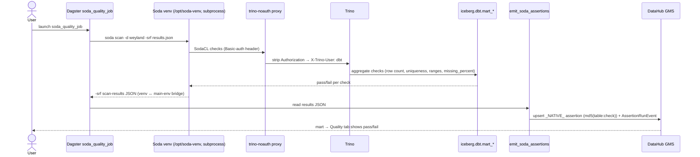

# Flow — Soda data-quality scan → DataHub Assertions (E2E)

Soda Core runs an **independent contract scan** over the 7 dbt marts (`iceberg.dbt.mart_*`) — row presence, key
uniqueness/completeness, value-range bounds, and per-column **emptiness tripwires** — then pushes each check to
**DataHub as a `_NATIVE_` DATASET Assertion** on the mart's `trino` URN. It is Slice C of the L5
(Governance/Security) layer (Ranger + OPA + Soda), complementary to dbt's in-transform tests: dbt validates
*during* the build (row-level, null-filtered); Soda validates the *published output* (aggregate) and so catches
all-NULL columns that dbt range checks pass vacuously. Soda lives in an isolated venv (`/opt/soda-venv`) inside
the `dagster-user-code` image and shells out; its Trino connector always sends HTTP Basic auth, so it must point
at the **`trino-noauth` proxy** (nginx strips `Authorization`) rather than Trino directly. The `-srf` scan-results
JSON is the venv↔main-env bridge that `emit_soda_assertions` reads back. There is no Soda web UI (Soda Cloud is
paid, $0 rule); results land in Dagster run logs and each mart's DataHub Quality tab. See
[../demos/soda-dq.md](../demos/soda-dq.md) and [../runbooks/soda.md](../runbooks/soda.md).

## Sequence

Assertions are stable, idempotent upserts (URN = `md5(table:check)`), so re-runs update the same records — they
are the governance record, normally left in place. The emptiness tripwire (`missing_percent(<col>) < 100`) fails
loudly on an all-NULL column, the class of bug it caught in `mart_country_health` (the WHO GHO code-vs-label bug
that nulled 7 columns).
