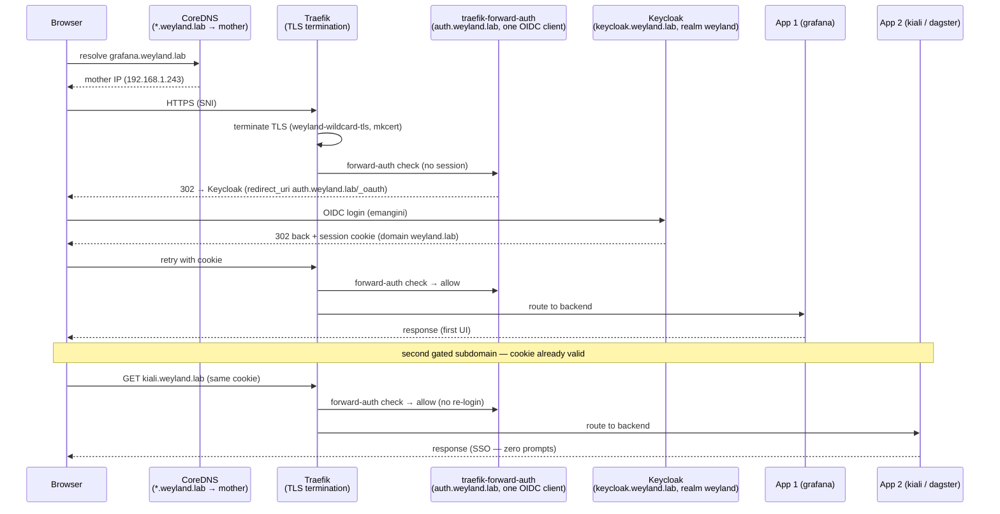

# Flow (E2E) — SSO: browser → Traefik → forward-auth → Keycloak → app (one login, every subdomain)

Cross-system thread of [flow-ingress-tls](flow-ingress-tls.md) and the Keycloak runbook
([../runbooks/keycloak.md](../runbooks/keycloak.md)): the first hit on a gated `*.weyland.lab` UI bounces through
Keycloak once; the forward-auth cookie (`COOKIE_DOMAIN=weyland.lab`) then covers **every** subdomain, so a second
gated app needs no second login. Demo: [../demos/sso-e2e.md](../demos/sso-e2e.md).

**Seams made explicit:** ingress/TLS owns DNS → Traefik → cert → middleware ([ingress-tls](../demos/ingress-tls.md));
Keycloak owns the realm + the single forward-auth client whose one redirect URI + `weyland.lab` cookie make SSO
work across subdomains ([keycloak runbook](../runbooks/keycloak.md)). Single logout for all:
`https://auth.weyland.lab/_oauth/logout`.
