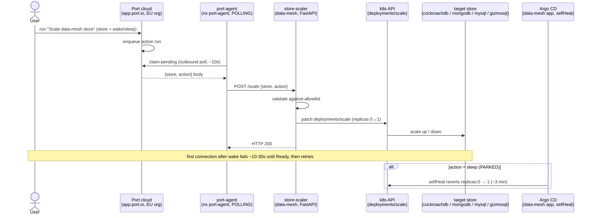

# Flow (E2E) — Store scale: Port action → port-agent (outbound poll) → store-scaler → k8s scale

Cross-system thread of [flow-store-scaler](flow-store-scaler.md) and the [store-scaler](../demos/store-scaler.md)
demo followed straight through: a Port self-service action becomes a live replica change. Port is SaaS (EU org)
and the lab is LAN-only, so the self-hosted **port-agent** connects **outbound** and polls for runs, then POSTs
the resolved `{store, action}` to the in-cluster **store-scaler**, which patches `deployments/scale`. Demo:
[../demos/store-scale-e2e.md](../demos/store-scale-e2e.md).

**One reusable execution path:** any "click a Port button → do X in the cluster" reuses this outbound-poll seam.
Gotcha chain: `STREAMER_NAME: POLLING` (not KAFKA) · EU org → `PORT_API_BASE_URL: https://api.port.io` (US
default 403s) · **Organization** creds not Personal · action needs a templated `body` or inputs arrive `null`.
Sleep is PARKED (Argo `selfHeal` wins over `replicas: 0`); the wake half is the live keeper.
