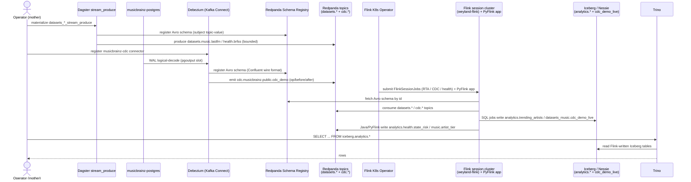

# Flow (E2E) — Streaming + CDC: produce / Debezium → Redpanda → Flink → Iceberg → Trino

Cross-system thread of [flow-streaming](flow-streaming.md) + [flow-cdc](flow-cdc.md) into
[flow-flink](flow-flink.md): a bounded Avro replay and a continuous WAL tail both land on Redpanda, Flink's four
jobs stream-process them, and the SQL jobs write Iceberg on the same Nessie catalog Trino reads. Demo:
[../demos/streaming-cdc-e2e.md](../demos/streaming-cdc-e2e.md).

**Seams made explicit:** streaming/CDC own producing the source topics
([streaming](../demos/streaming.md) / [cdc](../demos/cdc.md)); Flink owns consuming them into Iceberg + Kafka
([flink](../demos/flink.md)). RTA + PyFlink read the **bounded** `datasets.music.lastfm`; the CDC job reads the
**continuous** `cdc.*` topic; health reads `datasets.health.brfss`. Trino closes the loop by querying the Iceberg
that the two SQL jobs wrote.
