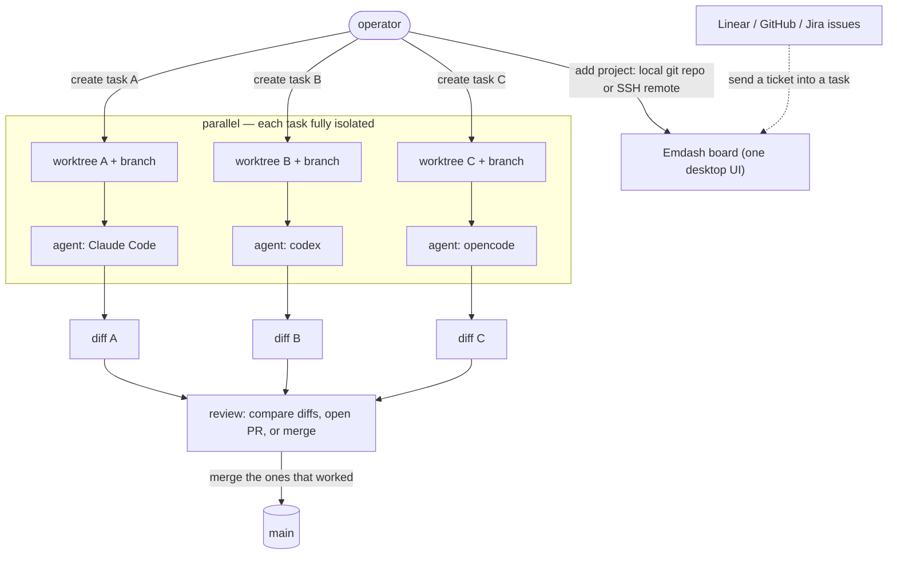

# Flow: Emdash — parallel agents, one worktree per task (B104)

Emdash (`generalaction/emdash`, MIT) is a desktop supervisor over the coding-agent CLIs the lab already
has. Its one real idea — the thing a single `claude` terminal does NOT give you — is **fan-out with
isolation**: each task gets its **own git worktree + branch + agent**, several run **at once**, and you
review/compare/merge them all from **one board**. One task looks like "Claude Code in a worktree"; the
value is at N tasks in parallel.

Why it matters (and where it doesn't):

- **Isolation** — worktree-per-task means task A's agent can't clobber task B's files; you can run three
  experiments on the same repo at once without a mess. (You *can* do this by hand with `git worktree add`
  — Emdash just makes it one click and gives you the board.)
- **Fan-out + review in one place** — start N agents, come back, compare the N diffs, keep the winners.
  This is the parallel-attempt pattern (try three approaches, pick the best) with a UI instead of a
  terminal-juggling exercise.
- **Ticket intake + remote** — pull a Linear/GitHub issue straight into a task; drive agents on a remote
  machine over SSH (fits the lab's rogueone/mother split).
- **Not a capability, a convenience** — for a **solo** lab it is nice-to-have, not a gap: one person can
  only babysit so many parallel agents, and the isolation is achievable with the CLIs directly. That is
  why the survey rated this category "optional / low for a solo lab." Adopt it when parallel work is
  actually the bottleneck.

Demo (installed + eyes-on): [../demos/parallel-agent-emdash.md](../demos/parallel-agent-emdash.md).
Recipe + install: [../runbooks/parallel-agent-supervisor.md](../runbooks/parallel-agent-supervisor.md).
