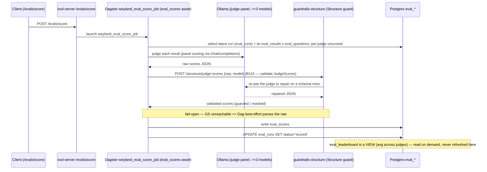

# Flow: Eval Scoring (`weyland_eval_score_job`, detail of the eval pipeline)

The second half of evaluation — judges the latest run's results with an LLM panel. Distinct from generation
(`weyland_eval_job` = `eval_testset` + `eval_run_matrix`); see [flow-eval.md](flow-eval.md) for the run side.
Triggerable via `/evals/score` (an audited act-tool — see [flow-act-tool.md](flow-act-tool.md)). The
`eval_leaderboard` is a **view** that averages across judges on read — the job never refreshes or materializes
it. Since **B115** each judge's raw JSON passes through the **`guardrails-structure`** service (the platform's
Structure layer) — validated against the `JudgeScores` schema and re-asked to repair on a miss — before it's written
(fail-safe: a best-effort parse if the service is down). See [runbooks/guardrails.md](../runbooks/guardrails.md).

