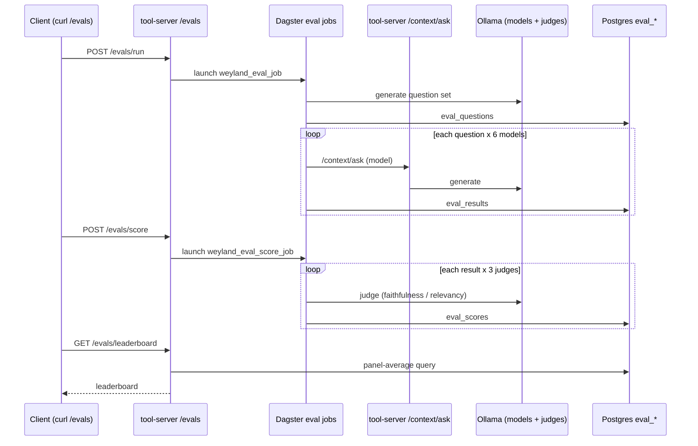

# Flow: Evaluation Pipeline (single-path eval -> panel -> leaderboard)

**B4 finding:** `gpt-oss:20b` is the most defensible RAG model (stable rank across configs; single-judge scoring proven noisy -> 3-judge panel).
