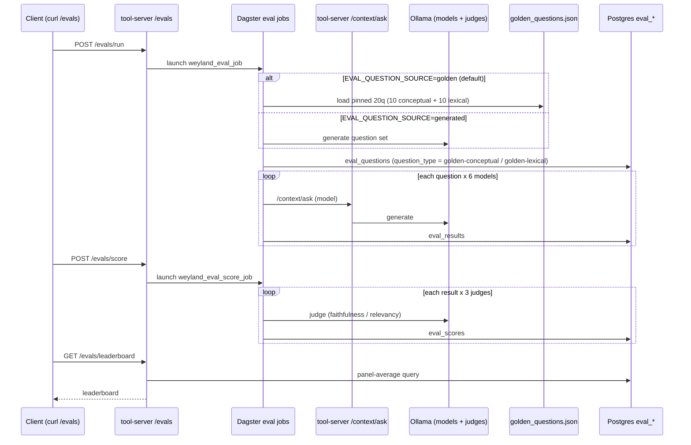

# Flow: Evaluation Pipeline (single-path eval -> panel -> leaderboard)

**B4 finding:** `gpt-oss:20b` is the most defensible RAG model (stable rank across configs; single-judge scoring proven noisy -> 3-judge panel).

**Why the `alt` matters (B96):** generated-per-run questions made the leaderboard **non-comparable across runs** —
each run was a different exam, so score deltas measured question difficulty, not system quality. `golden` is the
default; `generated` is kept because a static exam can be overfit to. The `question_type` written here is what lets
the leaderboard be **sliced** conceptual-vs-lexical, which is how retrieval changes are actually evaluated.
See [runbooks/eval-harness.md](../runbooks/eval-harness.md).
