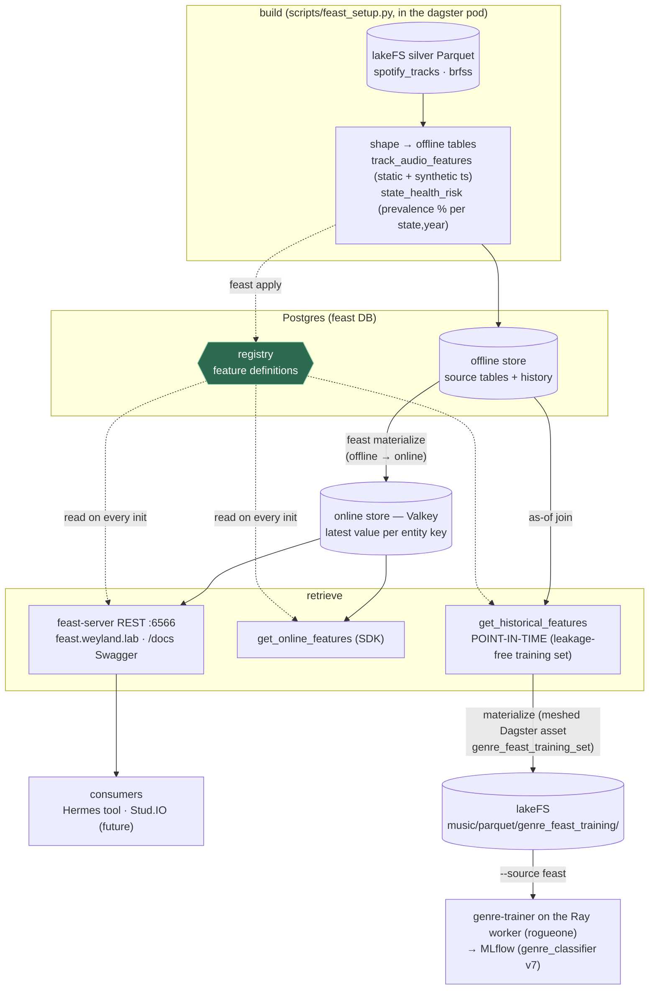

# Flow — Feast (feature store: offline / online / registry + point-in-time)

Feast is the odd store: not "silver → table," but a **feature store** — the same feature *defined once* and
served two ways. **Offline** (Postgres) for point-in-time-correct training sets; **online** (Valkey) for
low-latency serving by entity key; a **registry** (Postgres) holding the definitions, read on every access.
See [query/feast.md](../query/feast.md) + [runbooks/datasets-hydration.md](../runbooks/datasets-hydration.md).

**The three capabilities Feast adds** (none provided by the other stores):

1. **Low-latency serving by entity key** — `get_online_features(state=CA)` → prevalences in ms from Valkey.
   Vector stores do *similarity*, OLAP does *aggregates*; neither does "give me THIS entity's features, fast."
2. **Point-in-time training retrieval** — `get_historical_features` joins each label **as of its own timestamp**
   (CA-2013 ≠ CA-2019 — no leakage from future surveys). The thing a naive batch join gets wrong. **Now a live
   consumer:** the meshed Dagster asset `genre_feast_training_set` retrieves the genre-classifier's features this
   way → lakeFS → the external Ray trainer fits it (`--source feast` → `genre_classifier` v7). Feast's offline
   store is STRICT-mTLS Postgres, so this retrieval MUST run in-cluster/meshed — the external trainer can't reach
   it. See [../runbooks/mlflow-training.md](../runbooks/mlflow-training.md) UC2.
3. **Registry + train/serve consistency** — one feature definition serves both paths, so training and serving
   can't drift (a `FeatureService` like `recommender_v1` is the unit a consumer requests).

**Two views** demonstrate both halves: `track_audio_features` (entity `track`, static Spotify audio features →
the serving half) and `state_health_risk` (entity `state`, BRFSS chronic-condition prevalence per year →
the point-in-time half).

**Gotchas:**
- **The registry (Postgres) is on the *serving* path** — every `FeatureStore` init reads it, so online serving
  is Valkey **+ Postgres**, not pure Valkey.
- **feast-server is MESHED** (data-mesh, istio-injected) → mTLS to STRICT weyland-postgres; an unmeshed pod gets
  an opaque ECONNRESET (the `postgres-strict-needs-mesh` lesson) + `feast serve` exits on a one-shot startup
  connect, so `holdApplicationUntilProxyStarts` avoids the Envoy race. Slim feast image (not the fat dagster one
  → no OOM). psycopg3 requires `sslmode=disable` (weyland-postgres has TLS off).
- **Don't browse Valkey directly** — features are stored in Feast's binary encoding (serialized keys + protobuf).
