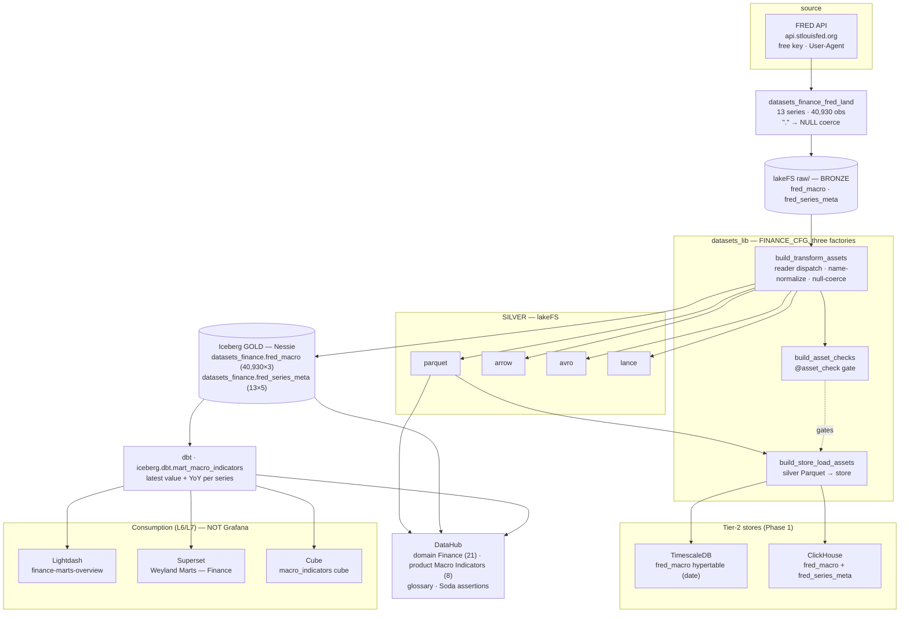
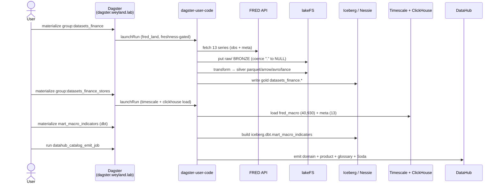

# Flow — Finance domain ingestion (FRED macro: land → silver → gold → fan-out → mart → BI)

The **finance** data domain (B113 Phase 1) riding the `datasets_lib` platform, same three-factory shape as
Music/Health — a `FINANCE_CFG` `DomainConfig` fed through **transform → asset-checks → store-load**. This is the
FRED macro slice: ~13 macro series (GDP, CPI, unemployment, Fed funds, treasury yields, M2, PCE, …), static
full-history snapshot. See [design/finance-domain.md](../design/finance-domain.md),
[query/finance.md](../query/finance.md), and the generic [flow-datasets-lakehouse.md](flow-datasets-lakehouse.md).

**Layers:** land (bronze) → transform (silver + gold) → quality gate → store hydration → dbt mart → BI. The FRED
missing-observation sentinel (`.`) is coerced to NULL in the lander, so `fred_macro.value` carries genuine gaps
(1,273 nulls) that the Soda check tolerates (`missing_percent(value) < 100`, never non-null). BI is **Lightdash +
Superset + Cube** over the mart — Grafana is the observability plane and carries no finance analytics.

**Deferred (static build):** streaming/live-refresh (Redpanda/Avro), and Cassandra/Postgres/graph tiers arrive
with the later phases (EDGAR XBRL, filings RAG, market OHLCV) per the design doc.

## Sequence

The runtime order for the FRED slice through the factories (as executed in Phase 1). Demo:
[demos/finance-domain.md](../demos/finance-domain.md).

