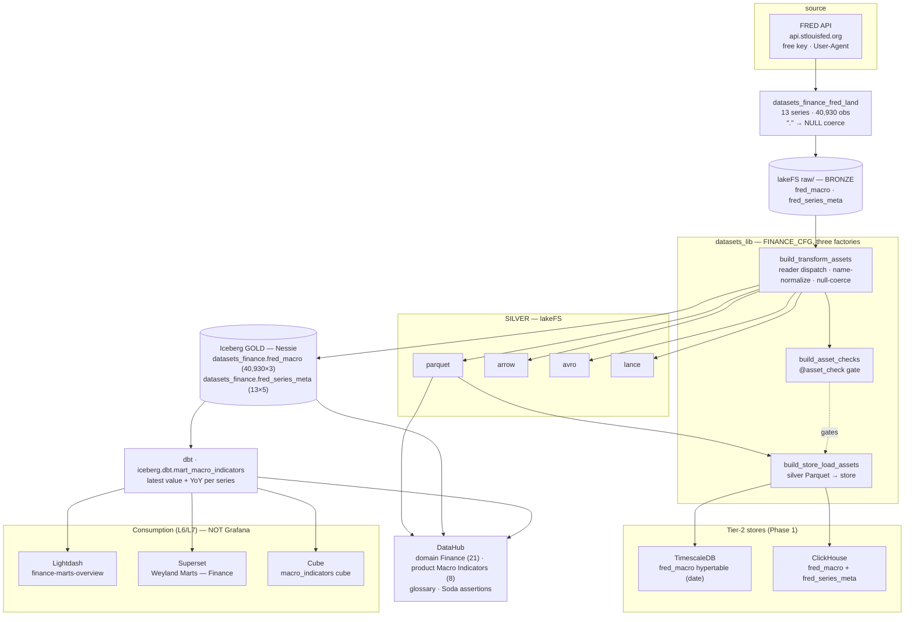
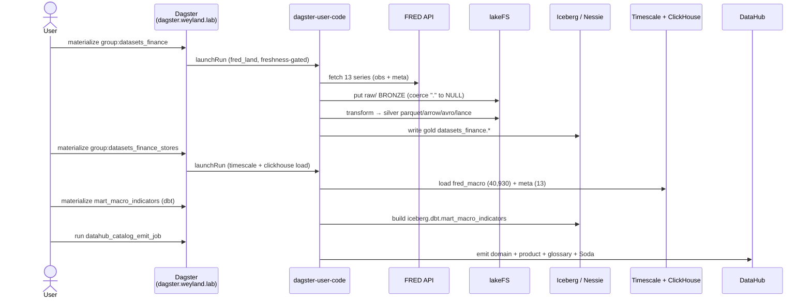
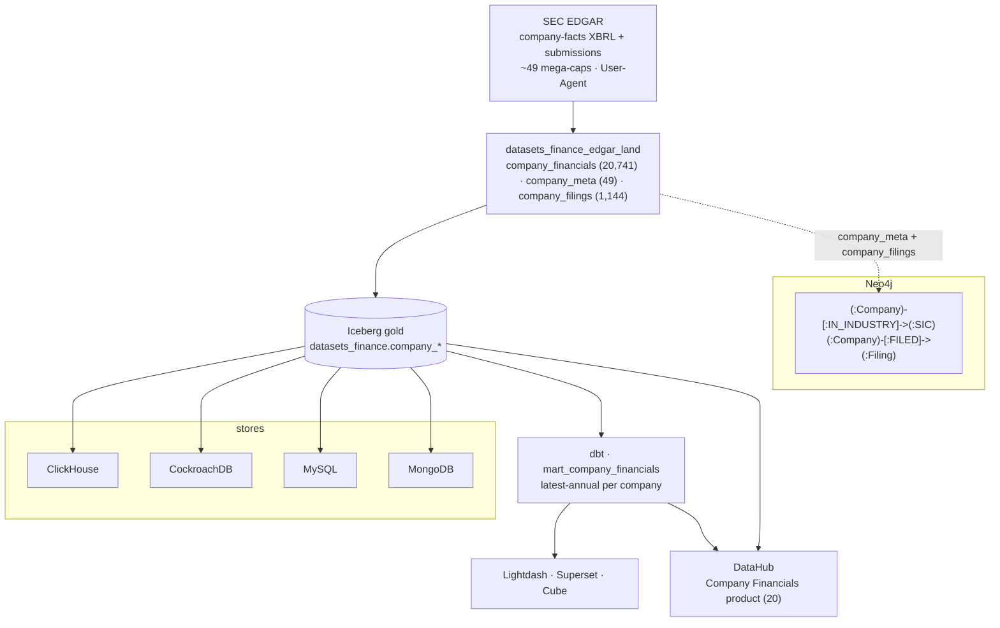
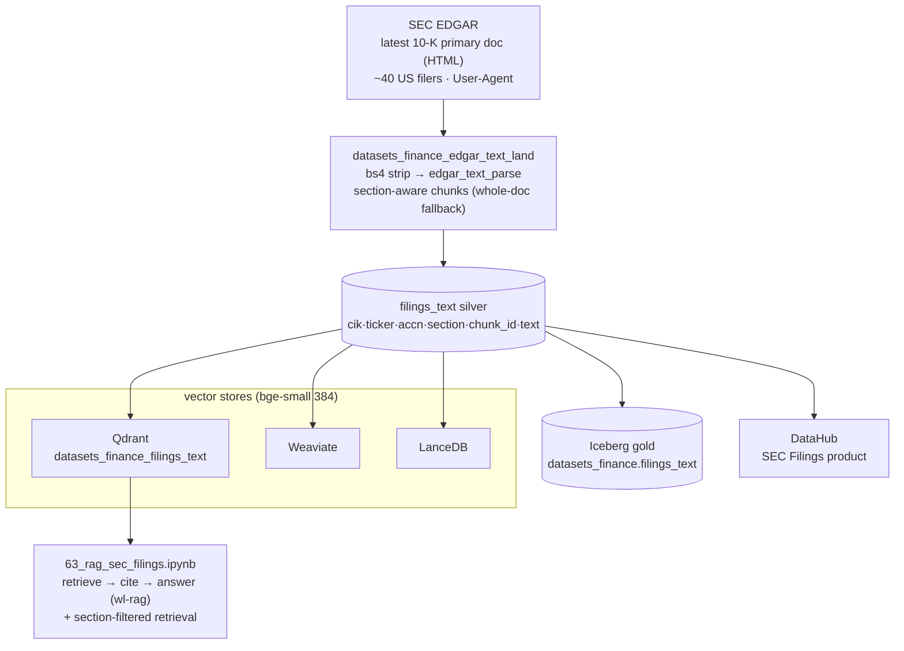
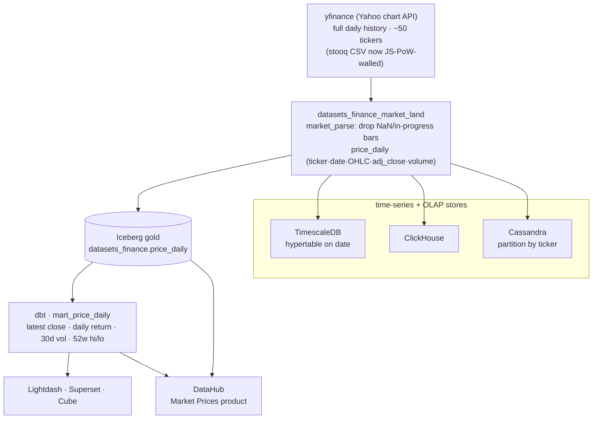

# Flow — Finance domain ingestion (FRED macro: land → silver → gold → fan-out → mart → BI)

The **finance** data domain (B113 Phase 1) riding the `datasets_lib` platform, same three-factory shape as
Music/Health — a `FINANCE_CFG` `DomainConfig` fed through **transform → asset-checks → store-load**. This is the
FRED macro slice: ~13 macro series (GDP, CPI, unemployment, Fed funds, treasury yields, M2, PCE, …), static
full-history snapshot. See [design/finance-domain.md](../design/finance-domain.md),
the per-store [query cookbooks](../query/) (finance sections in `trino.md` / `dbt-marts.md` / `timescaledb.md` /
`clickhouse.md` / `gizmosql.md`), and the generic [flow-datasets-lakehouse.md](flow-datasets-lakehouse.md).

**Layers:** land (bronze) → transform (silver + gold) → quality gate → store hydration → dbt mart → BI. The FRED
missing-observation sentinel (`.`) is coerced to NULL in the lander, so `fred_macro.value` carries genuine gaps
(1,273 nulls) that the Soda check tolerates (`missing_percent(value) < 100`, never non-null). BI is **Lightdash +
Superset + Cube** over the mart — Grafana is the observability plane and carries no finance analytics.

**Deferred (static build):** streaming/live-refresh (Redpanda/Avro), and Cassandra/Postgres/graph tiers arrive
with the later phases (EDGAR XBRL, filings RAG, market OHLCV) per the design doc.

## Sequence

The runtime order for the FRED slice through the factories (as executed in Phase 1). Demo:
[demos/finance-domain.md](../demos/finance-domain.md).

## Phase 2 — SEC EDGAR (structured financials + company graph)

Same three-factory path for the EDGAR slice, plus a Neo4j graph. `company_financials` (long facts) +
`company_meta` (dim) fan out to the tabular/OLAP stores + the `mart_company_financials` mart;
`company_filings` is graph-only.

`company_financials` + `company_meta` fan out to **five** tabular/document/OLAP stores — ClickHouse,
CockroachDB, MySQL, MongoDB, and the Iceberg gold — all 20,741 facts + 49 dims. The MySQL and MongoDB loaders
were once blocked on general (not finance-specific) defects, now FIXED: the MySQL loader self-provisions its
database (`CREATE DATABASE IF NOT EXISTS` + the `--init-file` schema grant, so no per-dataset root grant), and
the MongoDB loader casts date columns to timestamp so BSON can encode them (`mongo_encode.to_bson_encodable`).

## Phase 3 — SEC EDGAR filings-text RAG (narrative → vectors → citations)

The narrative half of EDGAR: each company's latest **10-K** text, section-aware chunked, embedded, and served
through the mesh's RAG lane. Structured facts stay in the Phase-2 mart; this is the prose.

Only the narrative Items (Business / Risk Factors / Legal Proceedings / MD&A / Market Risk) are emitted — the
numbers already live in `company_financials`, so Item 8's tables would dilute a text-RAG corpus. Section
detection anchors on the canonical Item titles and takes each item's **last** occurrence (skipping the
table-of-contents duplicate), validated against a real Apple 10-K; a filing where fewer than two sections
resolve falls back to whole-document chunking rather than silently dropping it. Each chunk's payload carries
`ticker`/`accn`/`section`/`chunk_id` so a retrieval hit is a **citation**, and the `section` tag lets the
notebook scope retrieval to (say) Risk Factors alone.

## Phase 4 — market OHLCV (daily prices → time-series stores → mart)

Daily price bars for the same ~50 mega-caps — the archetypal time-series slice, so it leads with a Timescale
hypertable (like FRED) and adds Cassandra, the one net-new store for the domain.

The lander drops the in-progress bar (yfinance returns today's row with a NaN close) so no NaN price reaches the
hypertable or poisons the mart's returns/volatility; `auto_adjust=False` keeps both the raw close and the
split/dividend-adjusted `adj_close`. Cassandra keys as `((ticker), row_id uuid)` — one company's whole history
in one partition, a synthetic uuid clustering column keeping every bar unique.

**Deferred / tracked:** ODCS contracts (B157); the ML lane (Phase 5 — a returns/volatility model over these prices).
