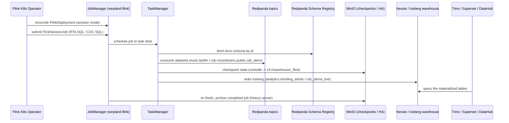

# Flow — Flink streaming-processing tier (B83)

Flink is the missing stream-**processing** engine for the B1.5 tier: Redpanda + Debezium already produce topics
(`datasets.*` Avro, `cdc.*` CDC) but nothing consumed them. A **Flink Kubernetes Operator** runs **one long-lived
session cluster** (`weyland-flink`, ns `data-mesh`, Flink 1.20, sidecar OFF) that many jobs submit to. Outputs
land in **Iceberg on the same Nessie catalog** as Trino/dbt — so they are instantly queryable in Trino/Superset
and auto-cataloged by DataHub. State + checkpoints go to MinIO (`s3://warehouse/_flink`). See
[../../aidlc-docs/construction/flink-streaming-design.md](../../aidlc-docs/construction/flink-streaming-design.md)
and [../demos/flink.md](../demos/flink.md).

Two real jobs (Flink SQL) + two example surfaces (Java DataStream, PyFlink):
1. **RTA — trending artists**: `datasets.music.lastfm` (`avro-confluent`) → 1-minute tumbling window (plays +
   distinct listeners per artist) → **append** Iceberg `analytics.trending_artists`. Bounded replay: reads
   earliest→latest, emits a MAX watermark on end-of-input so every window closes, then finishes.
2. **CDC → lakehouse**: `cdc.musicbrainz.public.cdc_demo` (`debezium-avro-confluent`) → **upsert** (Iceberg v2
   equality-deletes) `datasets_music.cdc_demo_live`.

**Current state (2026-07-14):** the session cluster is up (`flink.weyland.lab`), but the RTA job finished and its
Iceberg output is empty — a bounded job that completes disappears from the JobManager's in-memory store, and the
lastfm replay needs re-producing before a fresh submit. The demo marks these re-produce / re-submit steps as
pending.

## Sequence

**Two mechanisms for job survival:** Kubernetes HA persists *running* jobs across JM restarts (critical for the
continuous CDC materializer); archiving + a standalone History Server (`flink-history.weyland.lab`, planned step
2b) keep *finished* jobs investigable — the gap that made the first RTA submit vanish.
