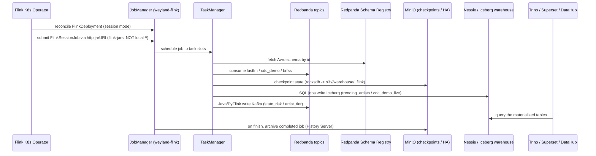

# Flow — Flink streaming-processing tier (B83)

Flink is the missing stream-**processing** engine for the B1.5 tier: Redpanda + Debezium already produce topics
(`datasets.*` Avro, `cdc.*` CDC) but nothing consumed them. A **Flink Kubernetes Operator** runs **one long-lived
session cluster** (`weyland-flink`, ns `data-mesh`, Flink 1.20, sidecar OFF) that jobs 1–3 submit to, plus one
isolated **application-mode** deployment for the PyFlink job. SQL outputs land in **Iceberg on the same Nessie
catalog** as Trino/dbt (instantly queryable, auto-cataloged by DataHub); the Java/PyFlink jobs write analytics
Kafka topics. State + checkpoints go to MinIO (`s3://warehouse/_flink`). See
[../design/flink-streaming-design.md](../design/flink-streaming-design.md)
and [../demos/flink.md](../demos/flink.md).

Two real jobs (Flink SQL) + two example surfaces (Java DataStream, PyFlink) — all four Flink authoring surfaces:
1. **RTA — trending artists** (SQL, bounded): `datasets.music.lastfm` (`avro-confluent`) → 1-minute tumbling window
   (plays + distinct listeners per artist) → **append** Iceberg `analytics.trending_artists`. Reads earliest→latest,
   emits a MAX watermark on end-of-input so every window closes, then finishes.
2. **CDC → lakehouse** (SQL, continuous): `cdc.musicbrainz.public.cdc_demo` (`debezium-avro-confluent`) → **upsert**
   (Iceberg v2 equality-deletes) `datasets_music.cdc_demo_live`.
3. **health — state risk** (Java DataStream + keyed state): `datasets.health.brfss` → per-state (`Locationdesc`)
   running mean of `Data_value` → Kafka `analytics.health.state_risk`.
4. **music — popularity tier** (PyFlink + Python UDF): `datasets.music.lastfm` → `SUM(play_count)` per artist → a
   Python UDF buckets the total into a tier → upsert-kafka `analytics.music.artist_tier`. Runs in its own
   application-mode `FlinkDeployment` (`weyland-flink-py:local`) to keep the ~1 GB python runtime off the session
   cluster.

**Current state (2026-07-15):** all four jobs validated end-to-end — RTA appended and queried in Trino, CDC running
continuously (upsert proven), health emitted 95,456 records, PyFlink produced 22,502 artist tiers (top = the
beatles). jar server, History Server, Prometheus metrics, and flame-graph profiling are live.

## Sequence

**Session-mode jars need a server.** A `FlinkSessionJob` jarURI must be fetchable by the operator (http/s3) — a
`local://` jar in the image only works in application mode. So `flink-jars` (nginx) serves `sql-runner.jar`
(runs the SQL files) and `health-job.jar` (the shaded Java DataStream fat jar) out of the image. The PyFlink job
sidesteps this by running in **application mode** (its own `FlinkDeployment`), where `local://` is fine.

**Two mechanisms for job survival:** Kubernetes HA persists *running* jobs across JM restarts (critical for the
continuous CDC materializer); archiving + a standalone History Server (`flink-history.weyland.lab`, serving
archived jobs at `/jobs/overview`) keep *finished* jobs investigable — the gap that made the first RTA submit
vanish. **Observability:** the Prometheus reporter exposes JM+TM metrics on `:9249` (scraped via the
`weyland-flink` `ServiceMonitor`), and per-operator flame graphs + the async-profiler are enabled on the cluster.
