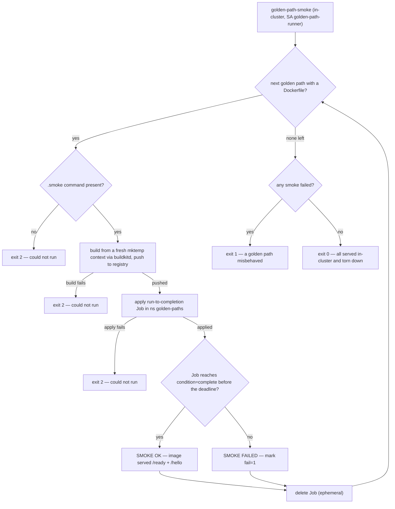

# Flow — golden-path smoke exerciser (B153)

The `golden-path-smoke` CI step proves each blessed template is a **buildable, runnable image on the platform** —
not just a passing test. For every golden path (a `golden-paths/<lang>/<framework>/` dir with a Dockerfile) it
builds via the estate's buildkitd, runs a **run-to-completion Job** that serves the contract, asserts, and tears
the Job down. The logic is a fail-closed decision with a three-value exit contract, so it earns a flow of its own.
The step deploys nothing durable (the Jobs are ephemeral); it runs in-cluster as the dedicated SA
`golden-path-runner` (ns `golden-paths`). Runbook: [woodpecker.md § dedicated ServiceAccount](../runbooks/woodpecker.md#gotchas-hard-won);
design: [golden-paths.md](../design/golden-paths.md); demo: [golden-paths.md](../demos/golden-paths.md).

## Per-path decision — fail closed (exit 2 could-not-run · exit 1 misbehaved · exit 0 served)

The exit split is the point: a build/apply that could not run is **exit 2**, a wrong verdict is **exit 1**, and the
step carries no `failure: ignore` — so a lane that could not do its job can never read as a clean pass. The
cluster-free decisions (target resolution, the `.smoke` requirement, dry-run) are bats-tested
(`scripts/tests/run-golden-path-jobs.bats`); the build + Job legs are proven live by the step itself (pipeline #95,
all 21 served).
