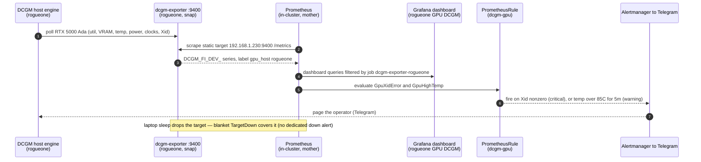

# Flow: rogueone GPU telemetry (B128)

rogueone's DCGM host engine feeds a snap `dcgm-exporter` on `:9400`; in-cluster Prometheus scrapes it as a static
off-cluster target, Grafana charts it, and two PrometheusRules turn GPU faults and thermals into pages. The target
flaps down when the laptop sleeps — that is covered by the blanket TargetDown net (no dedicated down alert), same
as the existing ray-worker target on the same box.

