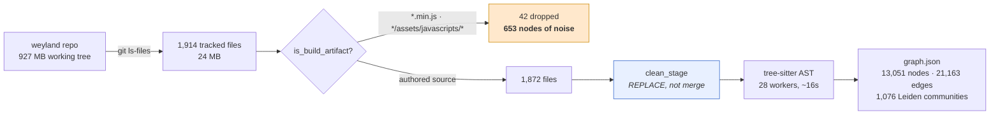
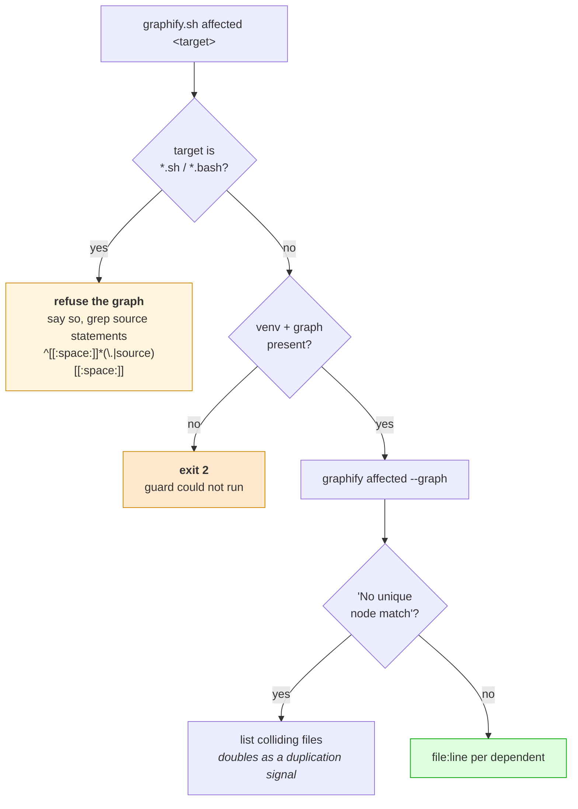
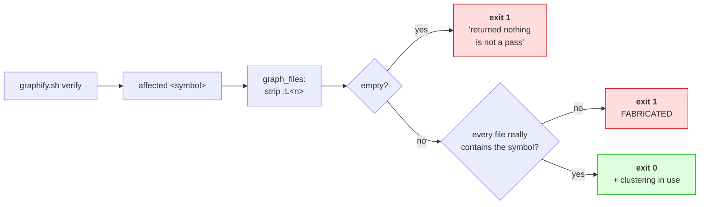

# Flow — Graphify code-cascade analysis (EMA-191)

How `scripts/graphify.sh` answers DoD Pillar 8's code half, and where it deliberately refuses to
answer. Evaluation and staged plan: `docs/concepts/graphify-adoption.md`.

## Build — tracked source, minus build output

**`clean_stage` is load-bearing.** `rsync --files-from` copies the listed files and deletes nothing
else — `--delete` is ignored because the transfer is not recursive. Without it the staged tree only
grows, so a file deleted from the repo keeps its nodes forever and `affected` can name a dependency
on a file that no longer exists.

**Build output is tracked too.** `git ls-files` keeps out provider binaries and venvs, but mkdocs
output is committed. Minification renames every identifier to one letter, manufacturing the label
collisions that make `affected` ambiguous.

## Query — and where it refuses

**Why the shell branch exists.** Bash `source` is not a dependency edge — `.ts` 1,029 import edges,
`.py` 448, `.sh` **0**. Raw graphify answers `No affected nodes found`, byte-identical to the answer
for a genuinely unused file, while 12 scripts source `lib/common.sh`. The wrapper refuses to pass
that silence through.

**Why matching the source statement matters.** A bare name match counts prose: the first version
reported `graphify.sh` as a dependent because its comments discuss `common.sh`, and reported
`check-servicemonitor-coverage.sh`, whose comment says *"DELIBERATELY DOES NOT SOURCE"* it.

## verify — what guards a pin bump

**A SUBSET, not equality.** graphify legitimately omits the definition site — a symbol is not
affected by itself — so demanding equality with grep would fail a correct answer. What it must never
do is name a file that does not contain the symbol. An empty result trivially satisfies "subset", so
it is failed explicitly; otherwise a completely broken upgrade would verify clean.

**The invariant:** every answer is either a real dependency set, an explicit refusal, or a loud
failure. There is no path where the wrapper checks nothing and reports success.
