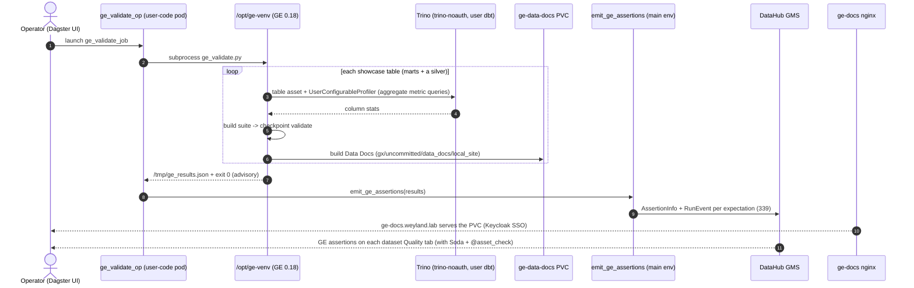

# Flow — Great Expectations auto-profiling → DataHub Assertions + Data Docs (B77 part b)

Great Expectations is the **profiling showcase** of the data-quality layer (part b) — on-demand, ~$0 standing RAM.
The `ge_validate_job` shells out to the isolated `/opt/ge-venv` (GE **0.18**, pinned because acryl-datahub 1.7 dropped
the native GE action). Per showcase table it opens a **Fluent Trino *table* asset** (user `dbt` via the `trino-noauth`
proxy), lets the **`UserConfigurableProfiler`** auto-generate a per-column suite (types, non-null, min/max/quantile
ranges, value sets, uniqueness — GE's actual differentiator), validates it with a checkpoint, and builds **Data
Docs**. The main-env `emit_ge_assertions` reads the validation-results JSON and hand-rolls each expectation into a
DataHub Assertion (nativeType = expectation type, column-scoped when it targets a column) — so GE lands **alongside
Soda and the `@asset_check` gate** on the same dataset's Quality tab (one pane, three sources). Data Docs write to the
`ge-data-docs` PVC (the run executes *in* the user-code pod via `DefaultRunLauncher`) and the `ge-docs` nginx serves
them at `ge-docs.weyland.lab`. The auto-profiler sets tight bounds, so some checkpoints fail on the same data —
expected, **advisory** (the op exits 0, never fails the job). See [../demos/great-expectations.md](../demos/great-expectations.md).

