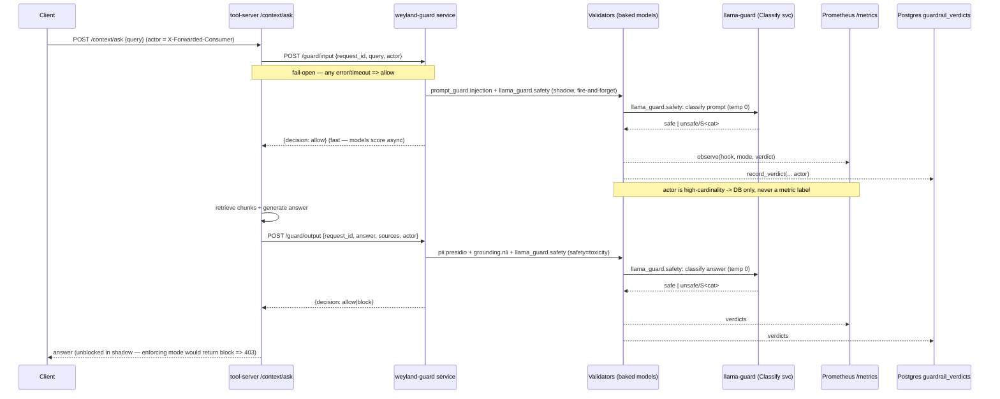

# Flow: Guardrail Validation (B14 + B70 Part 2 + B115 Classify — shared `weyland-guard` service)

Every `/context/*` call runs validator chains at the **INPUT** and **OUTPUT** hooks. Since B70 Part 2 the validators
live in a **standalone `weyland-guard` service** — the tool-server POSTs each hook to it over HTTP instead of running
models in-process. All validators ship **SHADOW** (fire-and-forget telemetry, never block); a mode flips to
`block`/`flag` via `GUARDRAIL_MODE__<validator>` env on `weyland-guard`. Active chains: INPUT = `prompt_guard.injection` +
`llama_guard.safety`; OUTPUT = `pii.presidio` + `grounding.nli` + `llama_guard.safety` (safety = toxicity since B117). The
**Classify** validator `llama_guard.safety` (B115) POSTs to the `llama-guard` svc — a Llama Guard content-safety
classifier (tier-1 1B on CPU/mother; on-demand 8B on the rogueone GPU) — and is itself fail-open. Enforcing ACT policy = B35.
The tool-server calls **fail-open**: a guard outage degrades to "not guarded", never "no answer". See
[runbooks/guardrails.md](../runbooks/guardrails.md).

