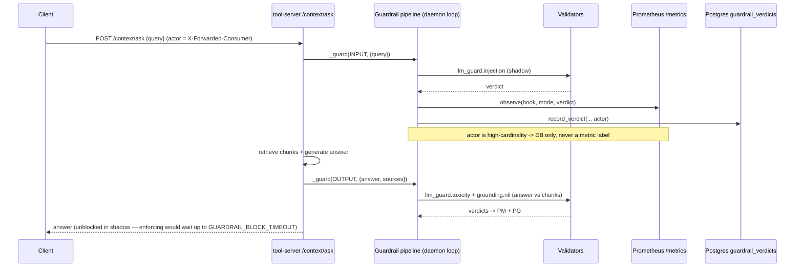

# Flow: Guardrail Validation (B14, shadow-first)

Every `/context/*` call runs validator chains at the **INPUT** and **OUTPUT** hooks. All validators ship
**SHADOW** (fire-and-forget telemetry, never block); a mode flips to `block`/`flag` via
`GUARDRAIL_MODE__<validator>` env. Active chain: INPUT = `llm_guard.injection`; OUTPUT = `llm_guard.toxicity`
+ `grounding.nli` (PII validator is coded but **deferred** — model not baked). Enforcing policy gate = B35.

