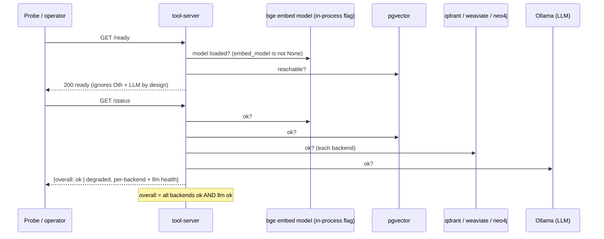

# Flow: Health / Status Aggregation (U12)

`/ready` and `/status` differ **deliberately**: readiness depends only on the embed model + pgvector, so a
non-default backend being down does NOT pull the server from the k8s rotation; `/status` reports the full
picture (overall `ok`/`degraded` = all backends ok **and** the LLM ok, plus per-backend + LLM detail).
`/health` stays a trivial liveness ping.

