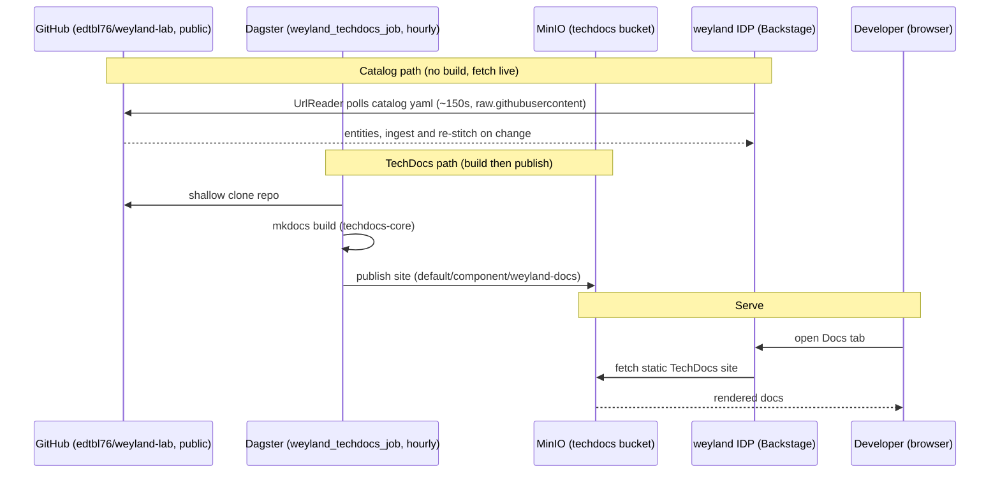

# Flow: self-syncing IDP (B41)

The weyland IDP tracks the repo with no manual republish, via **two mechanisms** — chosen by whether the
artifact needs a build. The **catalog** needs no build, so Backstage's UrlReader fetches it live from public
GitHub (`type: url`, polled ~150s) and re-ingests on change — no ConfigMap copy. **TechDocs** is servable
HTML that cannot live in the repo, so a Dagster job builds it hourly and publishes to MinIO, which Backstage
serves. Catalog reads use `raw.githubusercontent.com` (uncompressed); the GitHub API path is avoided.

