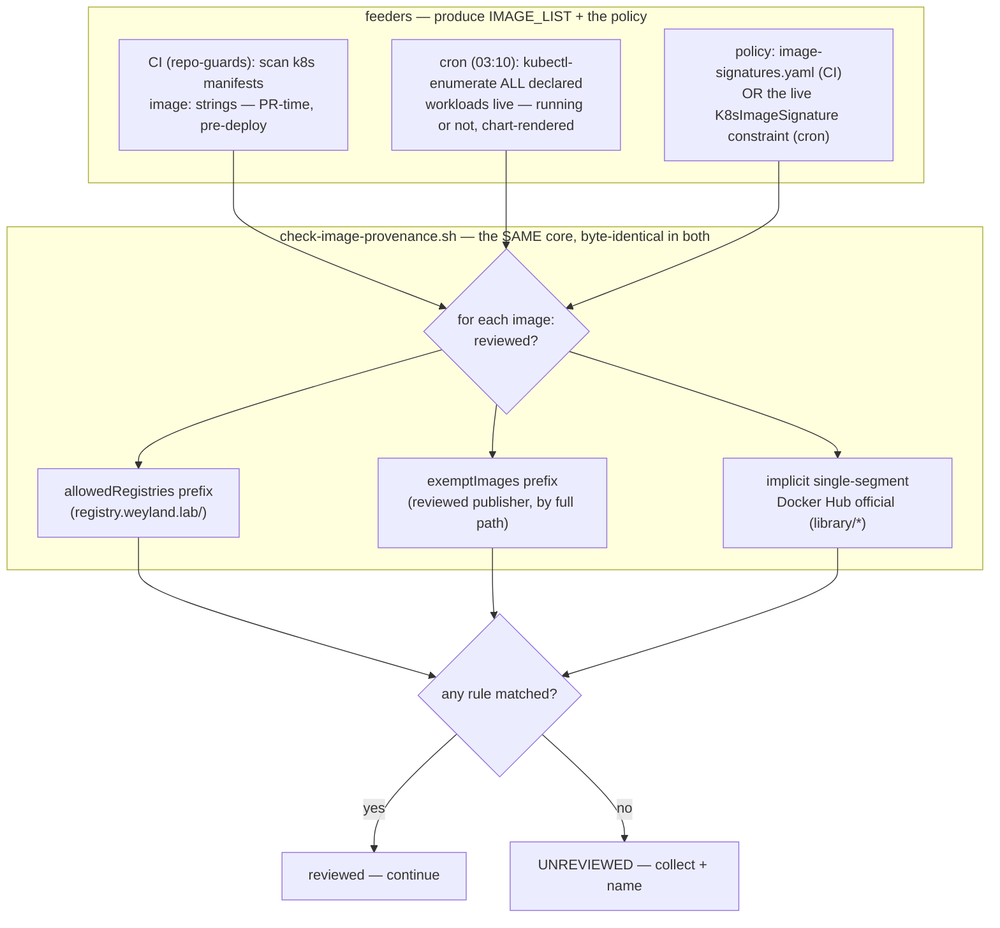
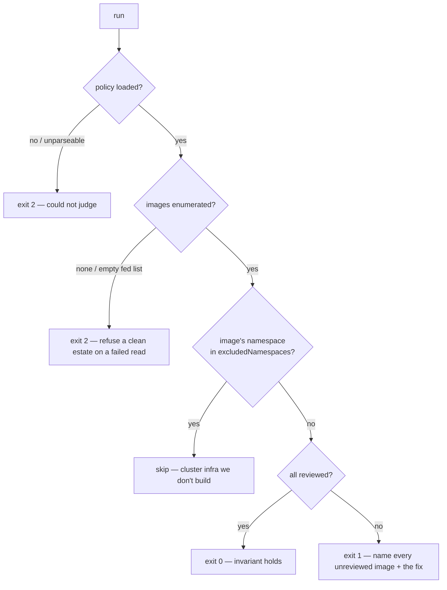

# Flow — declared-image provenance invariant (B88)

The Gatekeeper `require-signed-images` constraint only AUDITS running pods in dryrun, so its
"0 violations" is transient. Two guards turn it into a durable invariant — *every declared image is
from a reviewed source* — with ONE decision core fed two ways. Runbook:
[supply-chain.md § the provenance invariant](../runbooks/supply-chain.md#the-provenance-invariant--what-makes-0-violations-trustworthy);
demo: [image-provenance.md](../demos/image-provenance.md). LikeC4 placement is N/A for the CI guard
(it deploys nothing); the enumerator CronJob rides the existing `monitoring` Argo app.

## Two feeders, one decision core

## Fail-closed exit contract

- **One core, two feeders:** the git scan (CI, pre-merge) and the kubectl enumerator (cron, live) both
  produce an `IMAGE_LIST`; the decision — allowlist OR exempt-prefix OR implicit-official — is identical
  to the constraint's Rego and read from the same policy, so the guard and the admission control can
  never disagree. The enumerator's byte-identical copy is asserted in `image-provenance.bats`.
- **Fail closed:** exit **1** = a defect (an unreviewed image, named); exit **2** = the guard could not
  run (no policy, no images). They are never conflated — a broken guard must not read as a clean estate,
  the rule the whole coverage-guard family enforces. The cron's kubectl init-dump failing fails the Job.
