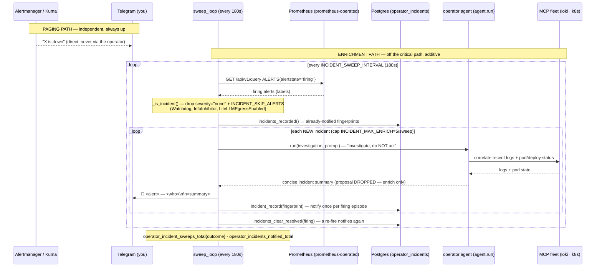

# Flow: Operator incident sweep (`weyland-operator`, B45)

The operator's **enrich-only incident sweep** — a background loop that runs strictly **off the critical alert path**.
It **reads** the currently-firing alerts from Prometheus (`ALERTS{alertstate="firing"}` — which already unifies every
firing `PrometheusRule`, including the blackbox synthetic `WeylandEndpointDown` and the guardrail/service down-alerts),
dedups against Postgres, and for each **new** incident invokes the operator agent to **enrich** it (correlate recent
logs + pod status via the MCP fleet), then posts a proactive Telegram digest. Any action the agent proposes is
**dropped** — acts stay behind the Telegram confirm flow. **Hard constraint:** the paging path stays
direct Kuma/Alertmanager→Telegram; if this loop dies, paging is unaffected — that is the whole point. See
[demos/incident-sweep.md](../demos/incident-sweep.md), [runbooks/operator.md](../runbooks/operator.md),
[flow-operator-brain.md](flow-operator-brain.md), [flow-alerting.md](flow-alerting.md).

