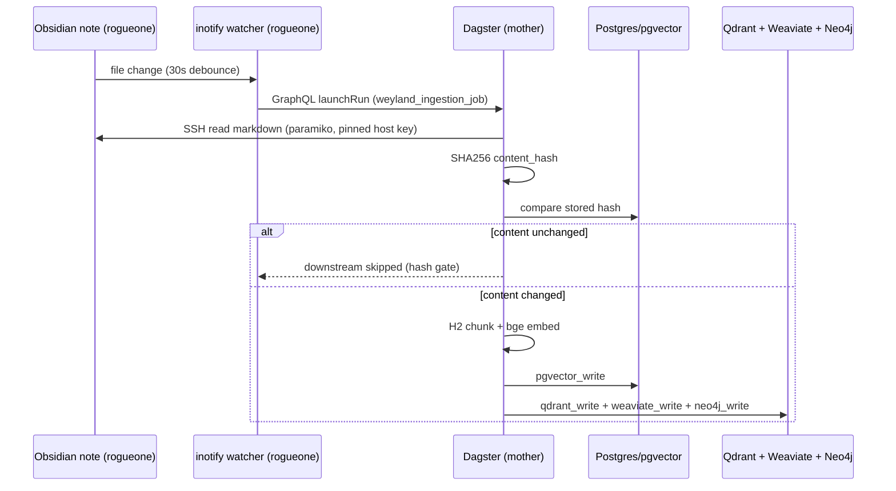

# Flow: Ingestion (docs -> 4 vector backends)

Current flow: Obsidian note on rogueone -> Dagster -> 4 backends. **B25 will replace the SSH/SFTP source with git-pull of the full docs/ tree.**

**B25 target flow:** git clone/pull docs/ -> chunk all .md files -> same 4-backend write pipeline. inotify watcher on Obsidian file will be retired.
