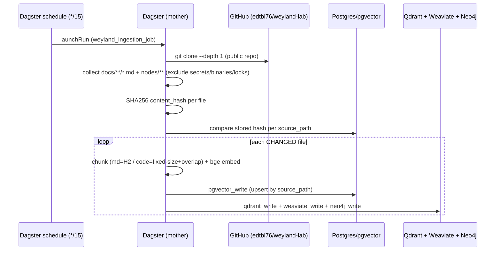

# Flow: Ingestion (repo → 4 vector backends)

**Live since 2026-06-15 (B25b).** Dagster shallow-clones the **GitHub repo** each run and ingests the whole
`docs/` tree (markdown) **+** `nodes/` code/manifests — decoupled from any one workstation. Per-file hash-gate;
markdown chunks by H2, code by fixed-size+overlap. (Replaced the old SSH/SFTP single-Obsidian-note source + the
rogueone inotify watcher, both retired.)

**Trigger:** the `*/15` cron (hash-gate makes a no-change run a cheap no-op). Near-real-time push-trigger is
deferred — **B30** (self-hosted GitHub Actions runner fires `launchRun` on push).
**Reconciliation:** each run prunes sources no longer in the repo — every write asset deletes entries whose
`source_path` isn't in the current collected set, across all 4 backends (skipped if the clone collected
nothing, so a bad run never wipes the store).
