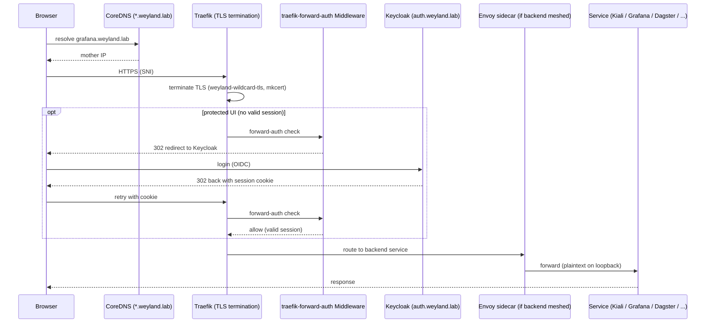

# Flow: Ingress / TLS Front Door

The shared path for every `*.weyland.lab` UI. CoreDNS resolves the wildcard to mother; Traefik terminates
TLS with the mkcert wildcard cert (`weyland-wildcard-tls`); protected UIs add the `traefik-forward-auth`
middleware (forward-auth → Keycloak SSO, was a basicAuth dev-password middleware); meshed backends add an
Envoy hop. Traefik is the *only* edge ingress — there is no Istio gateway. Single sign-on across
`*.weyland.lab` via `COOKIE_DOMAIN=weyland.lab`; single logout at `auth.weyland.lab/_oauth/logout`.

