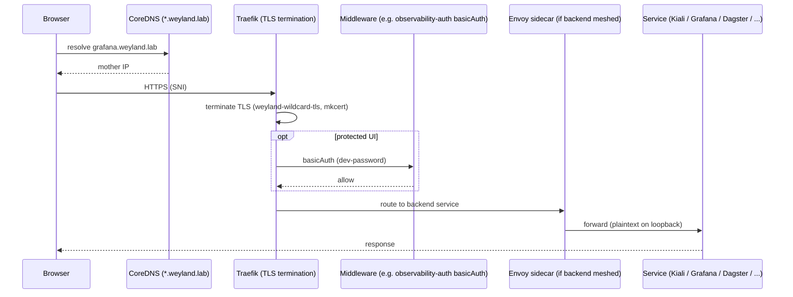

# Flow: Ingress / TLS Front Door

The shared path for every `*.weyland.lab` UI. CoreDNS resolves the wildcard to mother; Traefik terminates
TLS with the mkcert wildcard cert (`weyland-wildcard-tls`); protected UIs add a basicAuth middleware; meshed
backends add an Envoy hop. Traefik is the *only* edge ingress — there is no Istio gateway.

