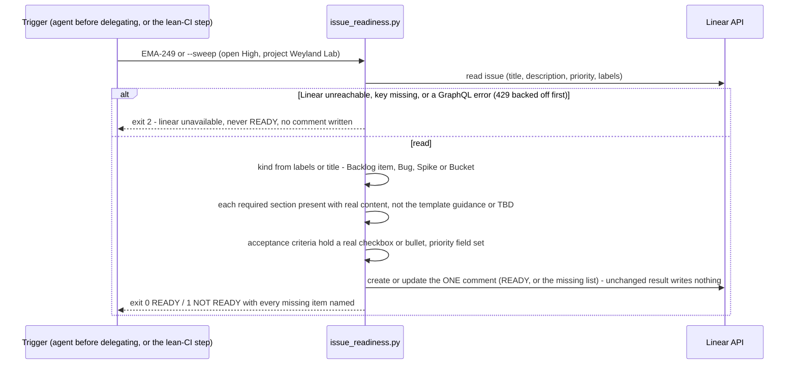

# Flow: issue readiness — the check that replaced SpecBot (B190, 2026-10-06)

Before an issue is delegated to a coding agent, `scripts/issue-readiness.sh` checks it against the lab's written
implementation-ready standard (`AGENTS.md`; per kind, the Linear template's sections). Rules only — no model, under a
second. One comment per issue names what is missing. Why it is not an LLM score:
[concepts/issue-readiness.md](../concepts/issue-readiness.md). Runbook: [issue-readiness.md](../runbooks/issue-readiness.md).

