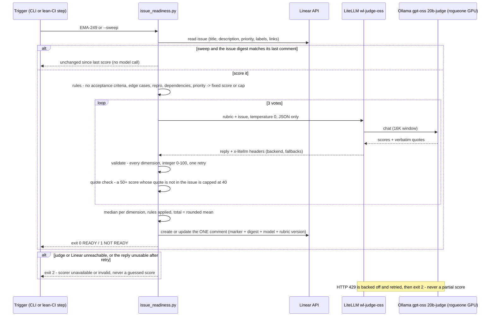

# Flow: issue readiness — the lab's scorer for Linear issues (B190, 2026-10-06)

Is a Linear issue ready to hand to a coding agent? `scripts/issue-readiness.sh` answers with 8 dimension scores and a
total (threshold 80), and keeps ONE comment on the issue current. Rules decide what the text can settle; a local judge
(gpt-oss:20b through LiteLLM `wl-judge-oss`) scores the rest, three times, and must quote the issue for every score of
50+. The lean-CI sweep re-scores only issues whose content changed. Runbook:
[issue-readiness.md](../runbooks/issue-readiness.md).

