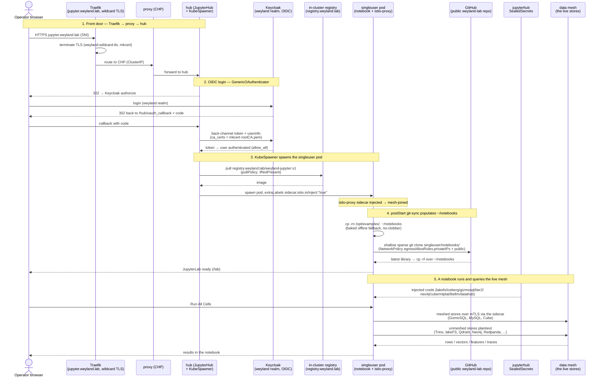

# Flow — JupyterHub notebook library (B81): spawn → git-sync → query the mesh

The end-to-end path a notebook takes, from an operator hitting `jupyter.weyland.lab` to a cell reading the live
data mesh. The Zero-to-JupyterHub hub + proxy are always-on and tiny; KubeSpawner spawns a per-user JupyterLab pod
on login, its `postStart` git-syncs the notebook **library** from the public repo (baked `/opt/examples` is the
offline fallback), and the pod is **mesh-joined** (an injected istio sidecar) so notebooks reach the meshed stores
over mTLS. Auth is Keycloak OIDC on a back-channel that trusts the mkcert CA. See
[runbooks/jupyterhub.md](../runbooks/jupyterhub.md), [flow-ingress-tls](flow-ingress-tls.md),
[flow-semantic-consumption](flow-semantic-consumption.md), `[[likec4-diagramming-b64]]`.

## The stores a notebook reaches (step 5, the fan-out)

Rather than 15 arrows, the mesh is one participant. The 25-notebook library spans the whole stack, each notebook
reading a real slice of the live mesh:

- **Storage** — lakeFS (git-for-data) · Nessie/Iceberg (table versioning) on MinIO.
- **Query** — Trino (federated SQL, unmeshed) · DuckDB embedded + **GizmoSQL** served over Arrow Flight SQL (meshed) ·
  the six Tier-2 native clients (ClickHouse/Cassandra/MongoDB/CockroachDB/TimescaleDB/**MySQL** — MySQL is meshed).
- **Vector / graph** — Qdrant · Weaviate · LanceDB (lakeFS-backed) · Neo4j (bolt).
- **Transform / semantic** — the 7 dbt marts via Trino · **Cube** SQL API (meshed).
- **Feature / ML** — Feast (Valkey online + Postgres point-in-time) · MLflow (tracking + registry).
- **AI / RAG** — LiteLLM gateway + Qdrant retrieval (local bge-base query embed).
- **Governance / quality** — DataHub (catalog + lineage) · Soda (trino-noauth) · Ranger (column masks).
- **Streaming** — Redpanda (Kafka API + Schema Registry) · Debezium CDC.

## Seams made explicit

- **Hub + proxy stay unmeshed; only singleuser pods join the mesh.** `sidecar.istio.io/inject:"true"` is a **pod
  label** (`singleuser.extraLabels`), not a namespace label — the istio object injector meshes only the pods that
  carry it. Meshed stores (GizmoSQL, MySQL, Cube) need the sidecar or a plaintext client deadlocks at their inbound
  proxy; unmeshed stores are reached over plain HTTP through the `privateIPs` NetworkPolicy allowance.
- **Two egress classes, one NetworkPolicy.** Z2JH's default singleuser policy blocks private cluster IPs (a security
  default) and the cloud-metadata block stays; `egressAllowRules.privateIPs: true` re-allows the mesh, and public
  egress (`0.0.0.0/0` minus the private ranges) is what lets the `postStart` GitHub git-sync and the `%pip` / HF
  downloads through.
- **Distribution is a `git push`, not an image rebuild.** The 2Gi home PVC hides anything baked at `/home/jovyan`,
  so `postStart` re-populates `~/notebooks` on every spawn: baked fallback first, then the latest from the repo
  (library == `main`). Scratch work lives elsewhere in home, which the PVC persists.
- **The OIDC back-channel trusts the mkcert CA.** The hub's server-side token/userinfo calls to
  `keycloak.weyland.lab` point libcurl at `/etc/mkcert/rootCA.pem` (`http_request_kwargs`), else a 599 SSL error
  500s the callback.
