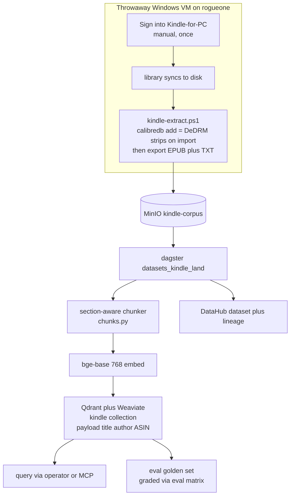

# Flow: Kindle library → KM RAG (B165)

"Log in once, script the rest." A throwaway Windows VM on rogueone extracts DRM-stripped EPUB/TXT to MinIO; the
weyland-dagster pipeline chunks → bge-base embeds → writes a `kindle` Qdrant/Weaviate collection; query via the
operator/MCP, graded against a golden set. The only manual step is the one-time Amazon sign-in.

Extraction runbook: [runbooks/kindle-rag.md](../runbooks/kindle-rag.md) · demo: [demos/kindle-rag.md](../demos/kindle-rag.md).
Reuses the finance-filings RAG pattern (B113), bge-base retrieval (B74), the vector stores (B1), the eval golden
set (B96). The book #1 gate (prove one decrypt before batching) lives in the runbook.
