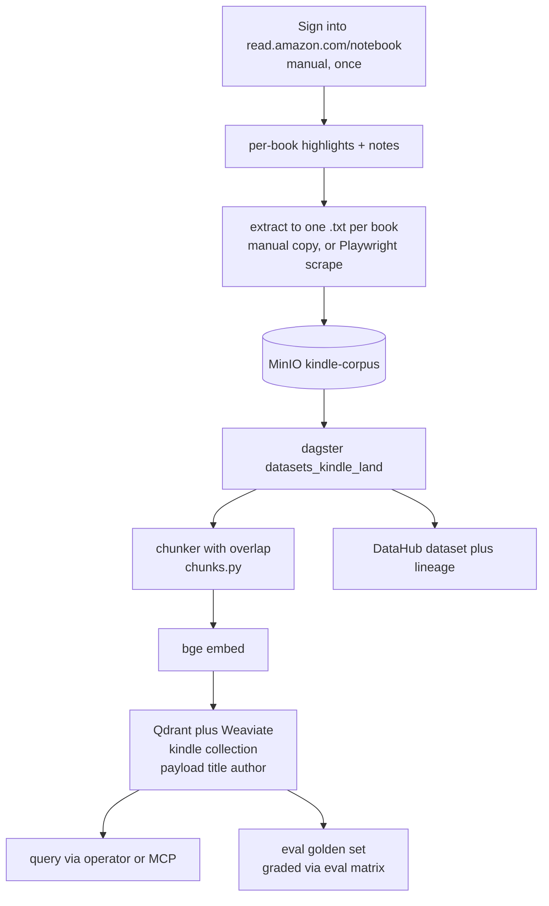

# Flow: Kindle highlights → KM RAG (B165)

Re-scoped 2026-09-20 to **highlights** (full-text via Kindle-for-PC is Amazon-locked — see the runbook). The
owner's highlights come from `read.amazon.com/notebook`; the weyland-dagster pipeline chunks → bge embeds → writes a
`kindle` Qdrant/Weaviate collection; query via the operator/MCP, graded against a golden set.

Runbook: [runbooks/kindle-rag.md](../runbooks/kindle-rag.md) · demo: [demos/kindle-rag.md](../demos/kindle-rag.md).
The ingestion half (MinIO → chunk → embed → collection → query/eval) is unchanged from the abandoned full-text plan
and was proven on a public-domain Gutenberg EPUB. Reuses the finance-filings RAG pattern (B113), bge retrieval
(B74), the vector stores (B1), the eval golden set (B96).
