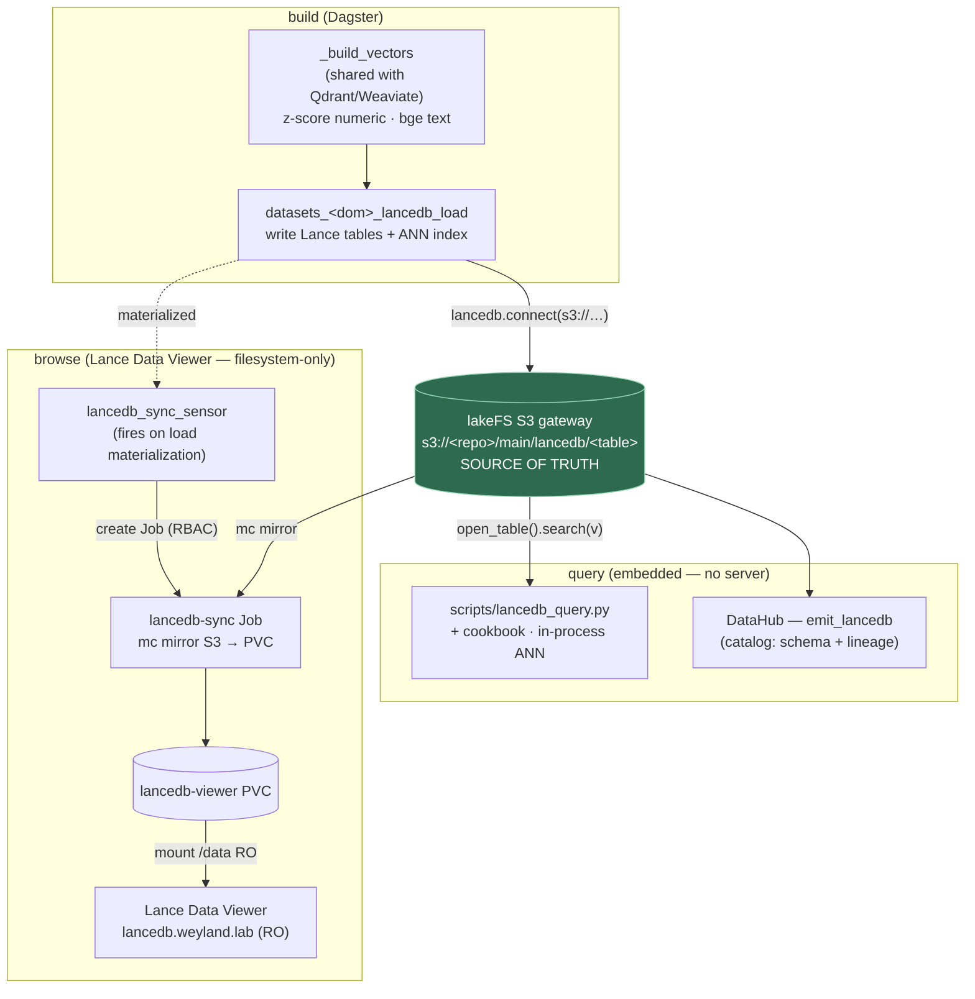
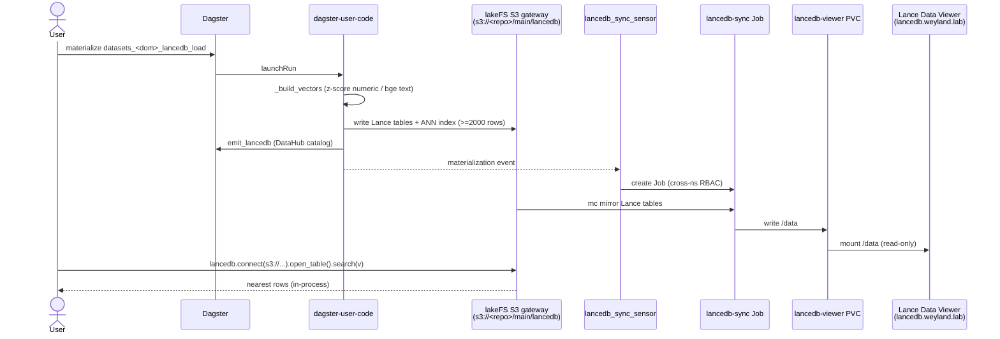

# Flow — LanceDB (embedded vector store + viewer + event-sync)

LanceDB is the odd one among the vector stores: **embedded** (a library, no server), **Lance-format-native**,
and backed by **object storage** (the lakeFS S3 gateway) rather than a pod's memory. That architecture makes
three things non-obvious — how you query it, how you browse it, and how the browse UI stays fresh. See
[query/lancedb.md](../query/lancedb.md) + [runbooks/datasets-hydration.md](../runbooks/datasets-hydration.md).

**Why each hop exists:**

- **Query = in-process.** No server/port/JDBC — you connect to the storage and search in the same process
  (`scripts/lancedb_query.py`, or the cookbook). Same as how the Qdrant/Weaviate *dataset* vectors are queried
  (via clients, not a served API). DataHub sees it via the `emit_lancedb` custom emitter (no native source —
  it's not a server DB).
- **Browse needs a mirror.** [Lance Data Viewer](https://github.com/lance-format/lance-data-viewer) is a nice
  read-only web UI, but it's **filesystem-only** (mounts a folder at `/data`, no S3). So a job `mc mirror`s the
  Lance tables from the lakeFS gateway → a PVC the viewer mounts read-only. lakeFS stays the source of truth;
  the PVC is a disposable read replica.
- **Sync is event-triggered, not polled.** The tables change *only* when a `lancedb_load` asset runs — so a
  Dagster **multi-asset sensor** watches those two assets and, on materialization, launches the mirror Job
  (created from the `lancedb-sync` CronJob template, via cross-namespace RBAC). The 6h CronJob remains a
  safety-net backfill. So: **load → sensor → mirror → fresh viewer**, no polling loop.

**Gotcha:** the sync Job runs in `data-mesh` and needs `lakefs-creds` there — that secret lives in `weyland`, so
it's copied into `data-mesh` **imperatively** (not in git). If `data-mesh` is rebuilt, recreate it
(`kubectl get secret lakefs-creds -n weyland -o yaml | sed 's/namespace: weyland/namespace: data-mesh/' | kubectl apply -f -`).

## Sequence

Build → in-process query, and the event-triggered mirror that keeps the browse UI fresh. Demo: [demos/lancedb.md](../demos/lancedb.md).

