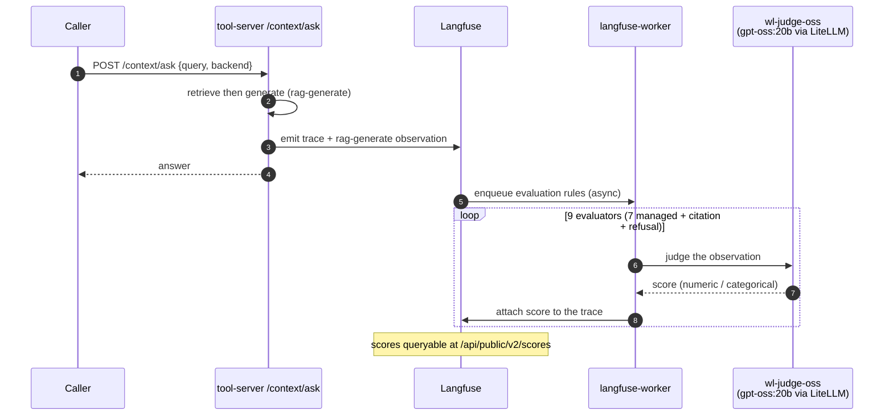

# Flow: Langfuse evaluation — online RAG grading (B103)

Online eval: every `rag-generate` observation is scored live by 9 LLM-as-judge evaluators on Langfuse's own engine
(judge = `wl-judge-oss`, local gpt-oss:20b, $0), no human in the loop. Complements the offline B84 MLflow judge-panel.

**Read-only** — grades live production traces. Demo: [demos/langfuse-evaluation.md](../demos/langfuse-evaluation.md).
