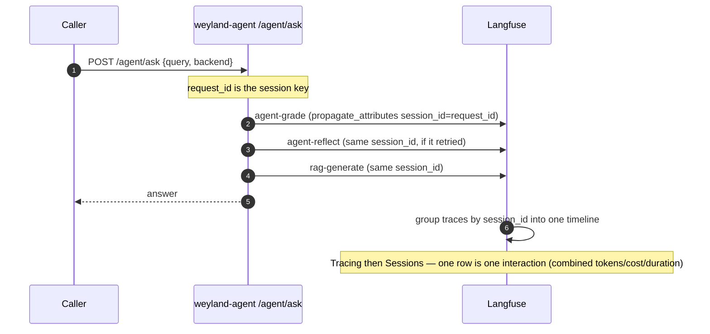

# Flow: Langfuse sessions — a run/conversation as one timeline (B103)

Sessions group related traces under one `session_id` so a multi-turn chat, one agent run, or one realm dispatch reads
as a single timeline (combined tokens/cost/duration). Shown: an agent run whose grade + reflect + generate share the
run's `request_id`.

**Read-only.** Other surfaces key by chat_id (operator), request_id (agent), dispatch uuid (realm).
Demo: [demos/langfuse-sessions.md](../demos/langfuse-sessions.md).
