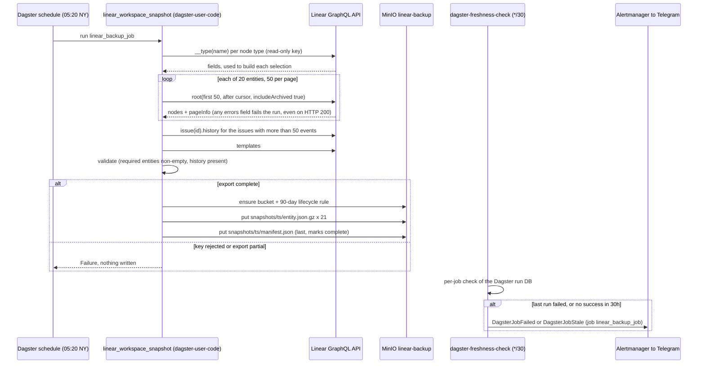

# Flow — Linear workspace backup (B194)

The nightly snapshot of the Linear workspace into MinIO. The Dagster schedule fires at 05:20 NY and the asset builds
each entity's field selection from the live schema (one `__type` introspection per node type, because full-schema
introspection exceeds Linear's 10,000 complexity cap). It pages every entity with archived items included, finishes
any issue history longer than one nested page, validates, and only then writes. `manifest.json` goes last, so a
snapshot without one is incomplete by definition. Operate: [runbooks/linear-backup.md](../runbooks/linear-backup.md).
DR row: [dr.md](../dr.md).

The second copy is out of band: `minio-backup` (22:30) mirrors `linear-backup` to mother's NVMe with the other
irreplaceable buckets ([dr.md](../dr.md) § Blast radius).
