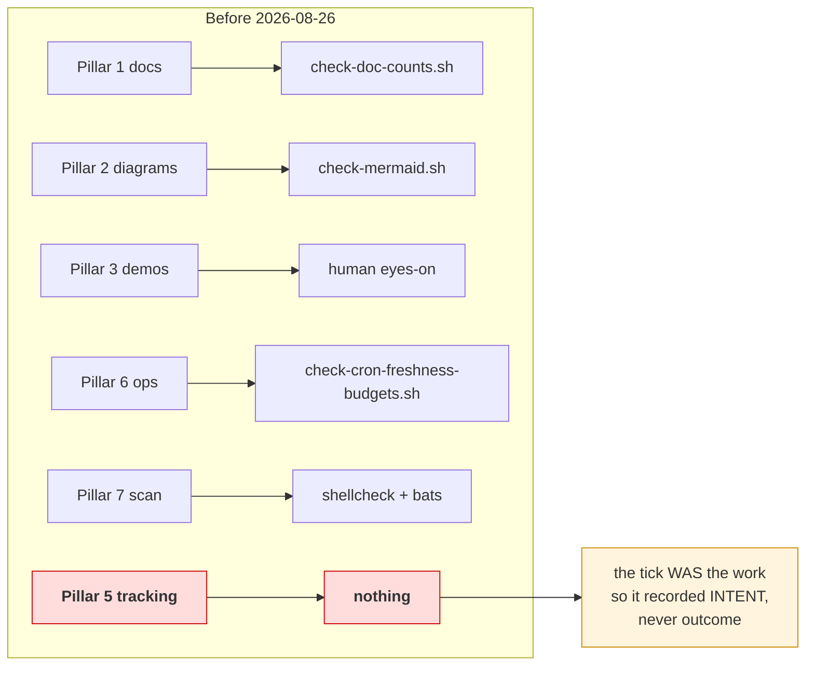
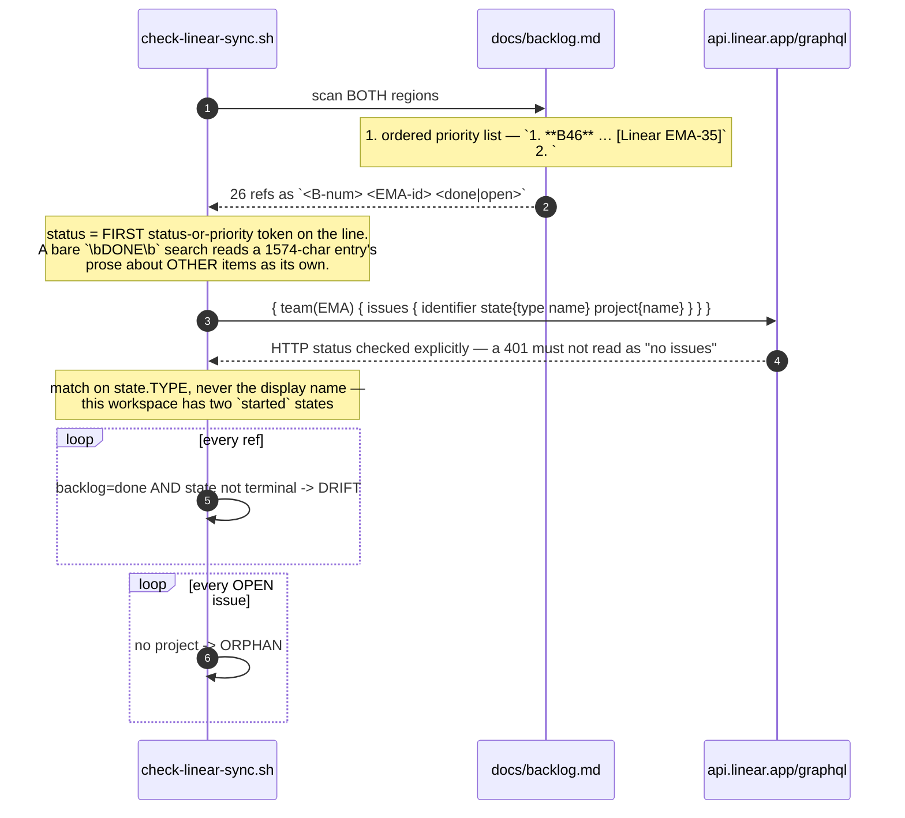
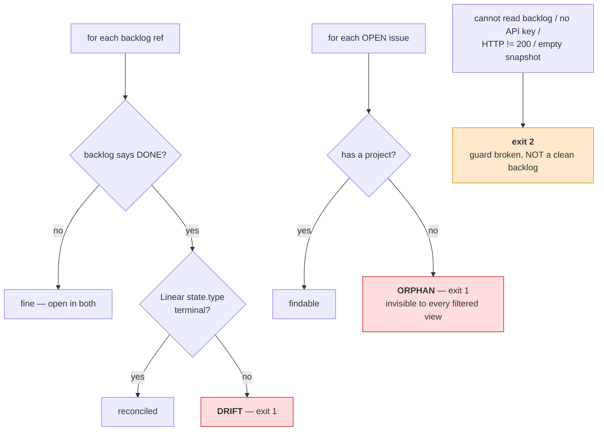

# Flow — DoD Pillar 5 reconciliation (backlog ↔ Linear)

Why the one pillar without a checker was the one that failed, and what checks it now.
Sequence + decision matrix (Mermaid); the gate itself is `docs/definition-of-done.md` § 5.

## The gap it closes

**It failed the day it was noticed.** The B148 close-out recorded *"5 — Linear EMA-207, backlog flipped"*
while **no Linear call had been made at all**; the issue sat in `Backlog`. Checking then found **B143**
had been open for two days after shipping, and **three** open issues had no project.

## What runs now

## The two checks

**One-way on purpose.** DONE implies closed; the converse is not asserted — an issue closed in Linear
while the backlog entry is still open is a normal mid-flight state, not drift.

**Exit 1 and exit 2 are never conflated.** A missing `LINEAR_API_KEY` must not read as a clean backlog.
That substitution — absence standing for success — is the defect this whole family of guards exists for.

**The invariant:** every backlog item claiming DONE is closed in the system that owns status, and every
open issue is reachable from a project filter. Neither is assertable by hand any more.
