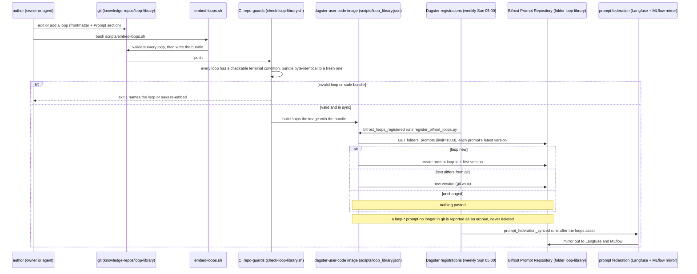

# Flow: the loop library, from git to Bifrost (B175)

The lab's reusable agent loops live in git (`knowledge-repos/loop-library/`, one Markdown file per loop, each with a
terminal condition) and are published to Bifrost's Prompt Repository so every harness can find them. The Dagster
image cannot read `knowledge-repos/`, so a generated bundle travels inside the image, and CI fails while the bundle is
stale. Git always wins: a changed loop becomes a new Bifrost version, an unchanged one posts nothing, and a loop
removed from git is reported, not deleted. See [knowledge-repos/loop-library/README.md](../../knowledge-repos/loop-library/README.md),
[demos/loop-library.md](../demos/loop-library.md), [runbooks/prompt-federation.md](../runbooks/prompt-federation.md).

