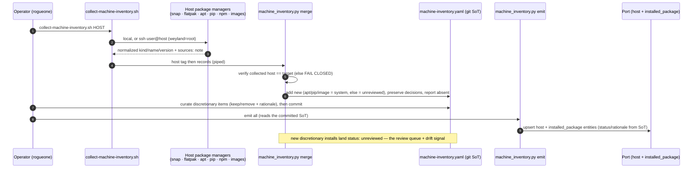

# Flow: machine-inventory catalog (B129)

Collect a host's installed software → merge into the git SoT (baseline vs discretionary, decisions preserved,
host-mismatch fail-closed) → emit to the Port catalog. Collector is read-only; only the SoT + Port are written.

Onboarding a new client is the same path (B169 / EMA-230). Demo: [demos/machine-inventory.md](../demos/machine-inventory.md).
Runbook: [runbooks/machine-inventory.md](../runbooks/machine-inventory.md).
