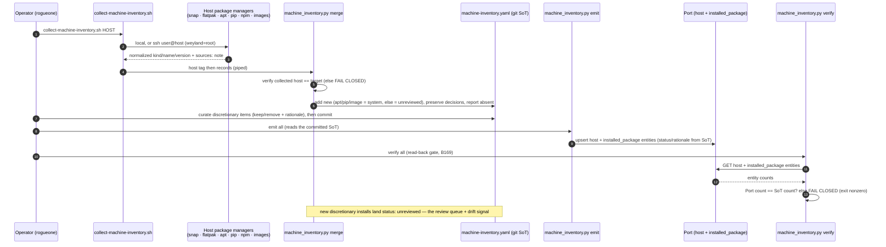
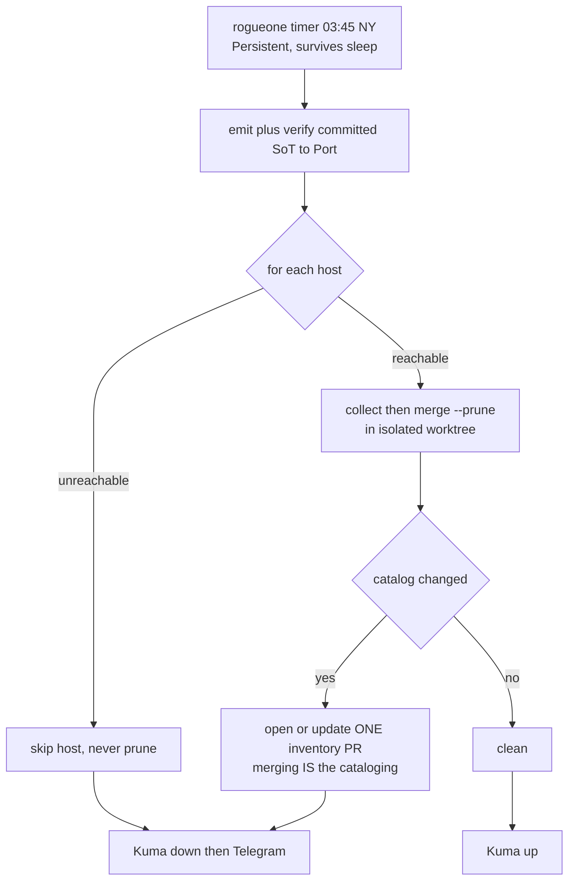

# Flow: machine-inventory catalog (B129 · verify gate B169)

Collect a host's installed software → merge into the git SoT (baseline vs discretionary, decisions preserved,
host-mismatch fail-closed) → emit to the Port catalog → verify the entities read back (B169, fail-closed).
Collector is read-only; only the SoT + Port are written; verify is read-only.

Onboarding a new client is the same path (B169 / EMA-230). Demo: [demos/machine-inventory.md](../demos/machine-inventory.md).
Runbook: [runbooks/machine-inventory.md](../runbooks/machine-inventory.md).

## Nightly drift check (B170)

Runs on rogueone (user timer, `Persistent=true`). Reconciles each reachable host into an isolated worktree,
opens/updates one inventory PR when the catalog changed, and pushes a Kuma heartbeat (down reaches Telegram).
An unreachable host is skipped, never pruned. Merging the PR is the only human step.

