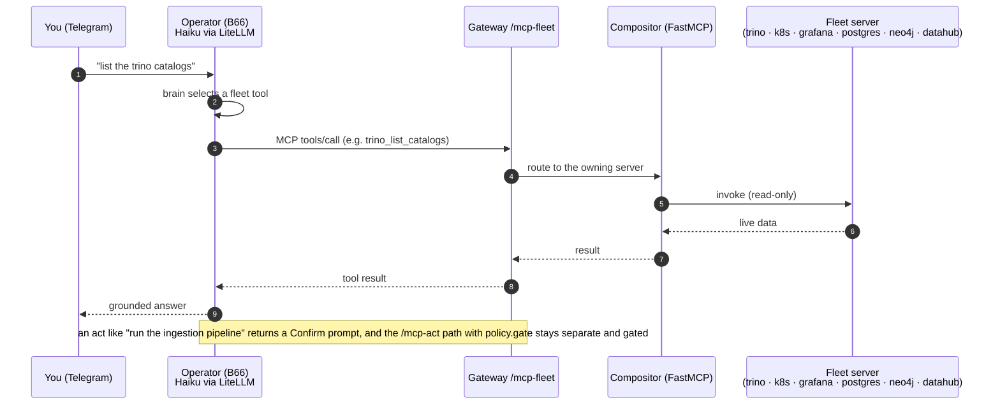

# Flow: MCP fleet — composed read-only server fleet (B17+B19 Phase 3)

The operator reasons over 6 read-only MCP servers (one per subsystem) aggregated by the compositor and fronted at
`/mcp-fleet`. Brain = Haiku via LiteLLM. Acts stay gated on the separate `/mcp-act` path.

Demo: [demos/mcp-fleet.md](../demos/mcp-fleet.md). Runbook: [runbooks/mcp-fleet.md](../runbooks/mcp-fleet.md).
