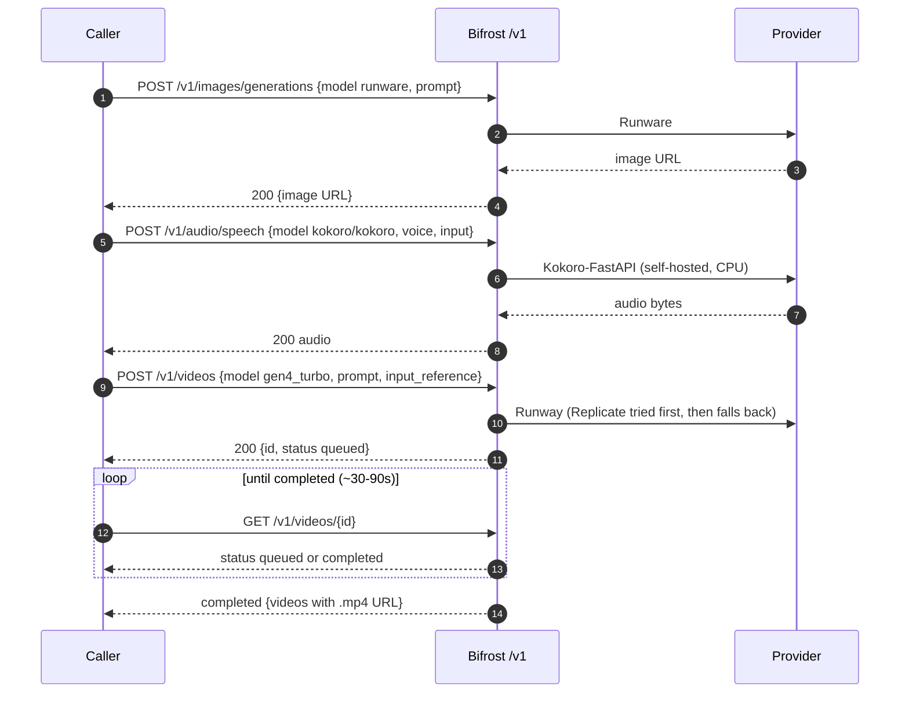

# Flow: Media lane — image · TTS · video (B111)

Multimodal generation through Bifrost, all OpenAI-shaped: image (Runware), TTS (self-hosted Kokoro, the $0 primary),
and video (Runway — async submit then poll). One caller, the `/v1/...` verbs it already knows.

Demo: [demos/media-lane.md](../demos/media-lane.md). Loadout: [design/bifrost-provider-loadout.md](../design/bifrost-provider-loadout.md).
