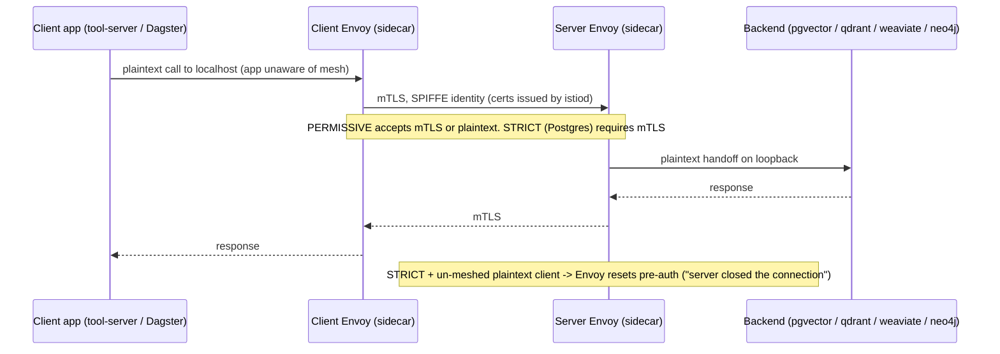

# Flow: Service-Mesh Request Path + mTLS (B8)

How an in-cluster (east-west) call traverses the Istio sidecars. Slice 1 is **PERMISSIVE** (accepts mTLS
*and* plaintext); **Postgres is STRICT** (plaintext rejected pre-auth). The app is unaware of the mesh — it
calls localhost and Envoy does the rest. Traefik stays the *edge* ingress; the mesh is east-west only.
TCP backends (neo4j Bolt, Postgres) need `appProtocol: tcp` or Envoy mis-parses them as HTTP.

