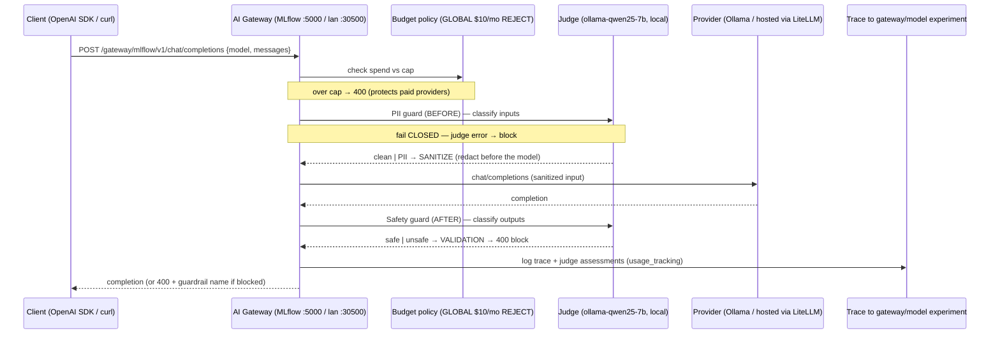

# Flow: MLflow AI Gateway (B100 P4 — guarded, budgeted model invocation)

One OpenAI-compat call — `POST /gateway/mlflow/v1/chat/completions` with the endpoint name as `model` — passes the
gateway's **budget** check, a **PII guardrail** (BEFORE/sanitize), the target **provider** (local Ollama, or a hosted
provider natively / via LiteLLM), and a **Safety guardrail** (AFTER/block), while **usage tracking** logs a trace to
the `gateway/<model>` experiment. Guardrail judges = the local `ollama-qwen25-7b` endpoint (no quota; the one terminal
unguarded judge). Guards **fail closed** (judge error/unavailable → block). Endpoints, scorers, guardrails, and the
budget are all codified + self-healing in `scripts/register_gateway_endpoints.py`. See
[runbooks/mlflow-gateway.md](../runbooks/mlflow-gateway.md).

**Judge topology:** exactly one **terminal unguarded** judge (`ollama-qwen25-7b`) — guarding it would recurse
(guard → judge → its own guard → …). Gemini's 20-RPM free tier fails-closed under load, so the judge is local; a 3b
judge false-blocks benign traffic, so `qwen2.5:7b` is the sweet spot. Related: [flow-guardrails.md](flow-guardrails.md)
(the B14/B70 `/context/*` guard plane), [runbooks/mlflow-gateway.md](../runbooks/mlflow-gateway.md).
