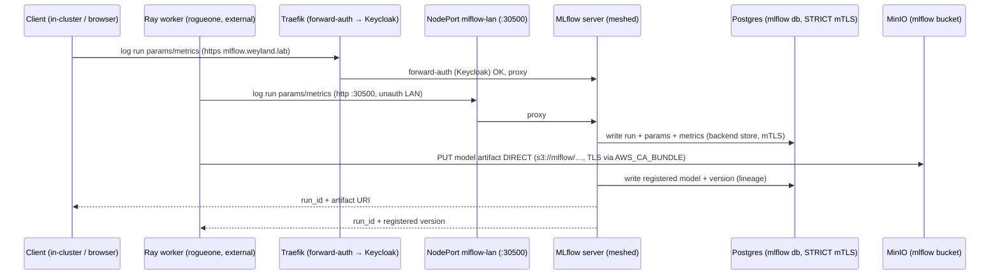

# Flow: MLflow tracking + artifacts (B10+B16) — two-plane

A client (a training or eval run) logs to MLflow. **Two access planes:** browser / in-cluster clients hit
`mlflow.weyland.lab` (Traefik + Keycloak `traefik-forward-auth`); the **external Ray worker** (rogueone) hits the
**LAN NodePort `192.168.1.243:30500`** (`mlflow-lan`, unauth, `externalTrafficPolicy: Local`, iptables-pinned to
rogueone) — the SSO ingress is browser-only and svc DNS is cluster-only. **Two data planes:** run metadata
(params / metrics / tags + registry versions) → **Postgres** over STRICT mTLS (the pod is meshed); **artifacts** —
small ones can proxy via `--serve-artifacts`, but **big models upload DIRECT to MinIO** (the experiment's
`artifact_location=s3://mlflow/…`) because the serve-artifacts proxy times a multi-GB `model.pkl` out through the
1Gi MLflow pod. The external worker's TLS to MinIO (`s3.weyland.lab`) is verified via `AWS_CA_BUNDLE` (mkcert root).

