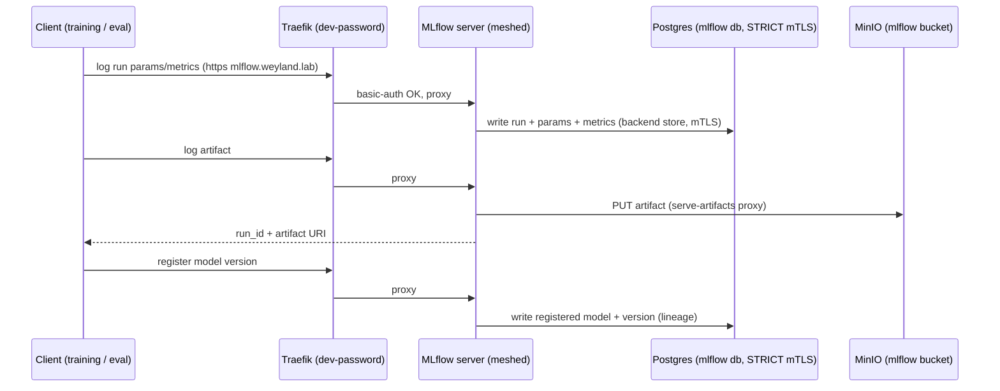

# Flow: MLflow tracking + artifacts (B10+B16)

A client (a training or eval run) logs to MLflow at `mlflow.weyland.lab`. Traefik gates with the dev-password
(`basicAuth` middleware), then proxies to the MLflow server. Run metadata (params/metrics/tags) goes to the
**Postgres** backend store over STRICT mTLS (the pod is meshed). Artifacts are uploaded **through** MLflow
(`--serve-artifacts`) to the **MinIO** `mlflow` bucket — clients never need MinIO creds. The model registry
versions live in the same Postgres store.

